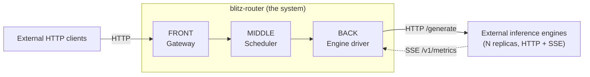
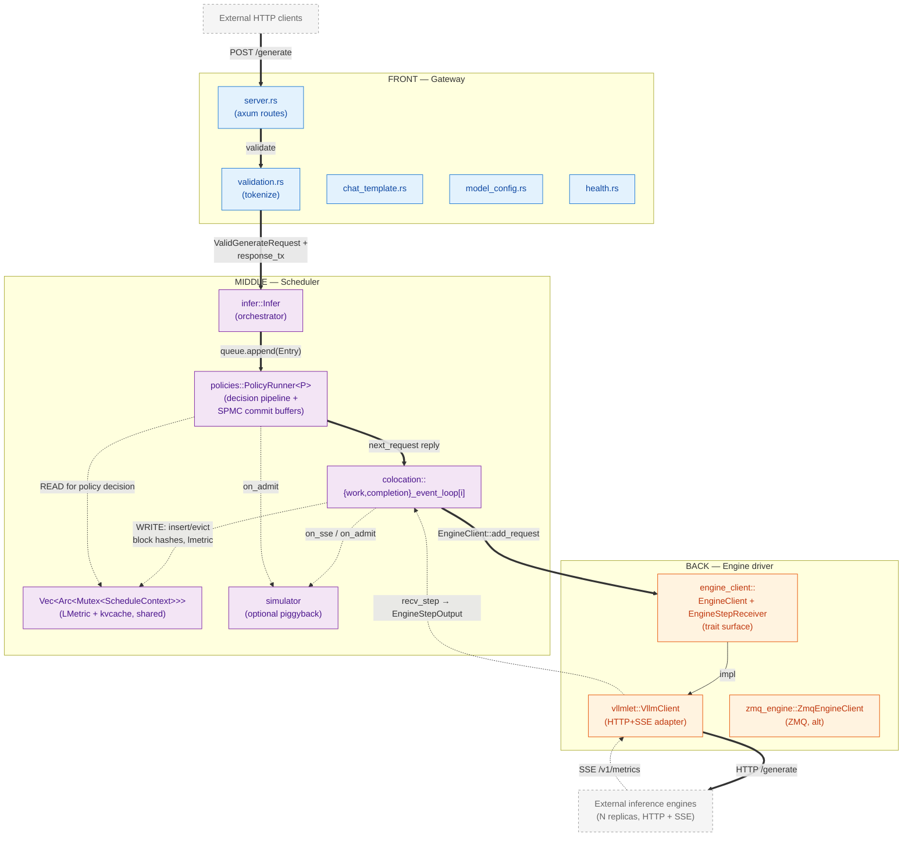
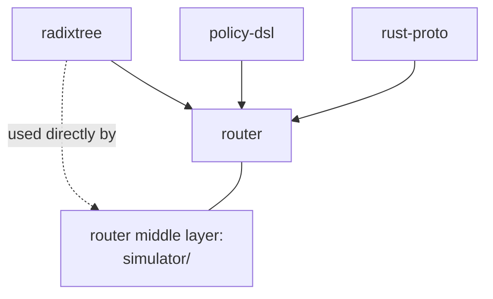
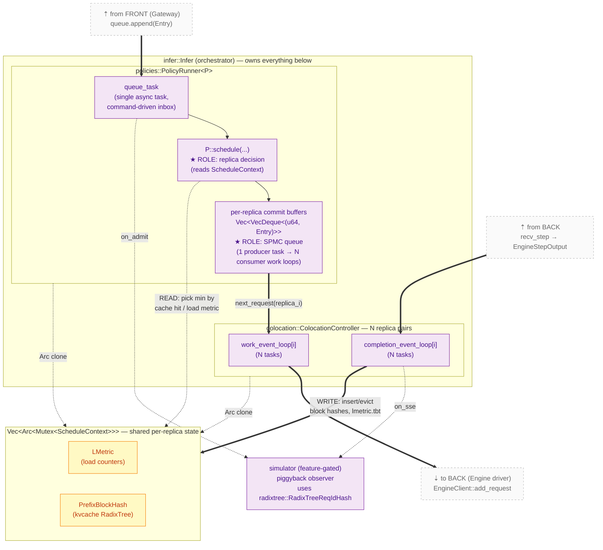
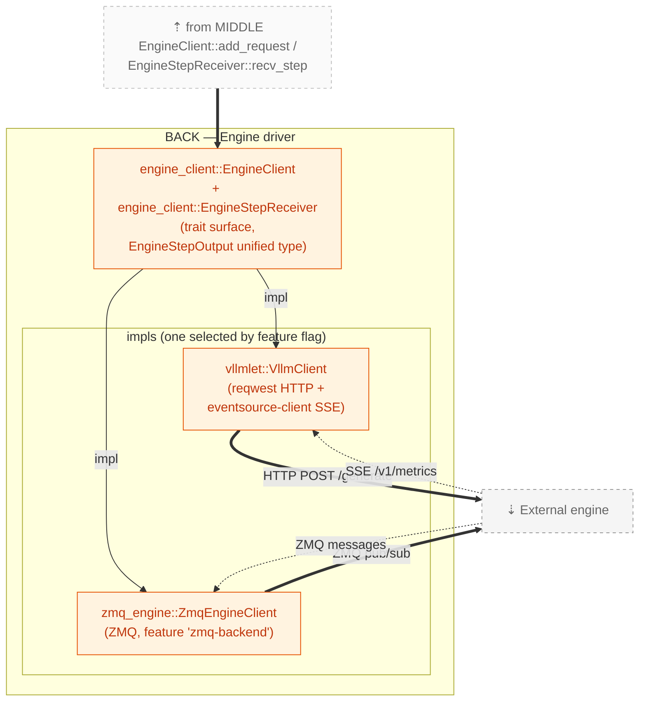
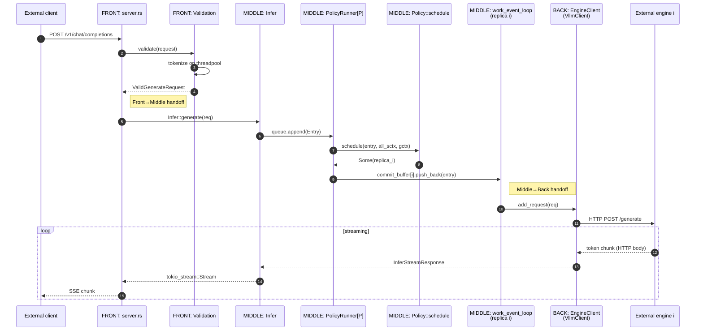
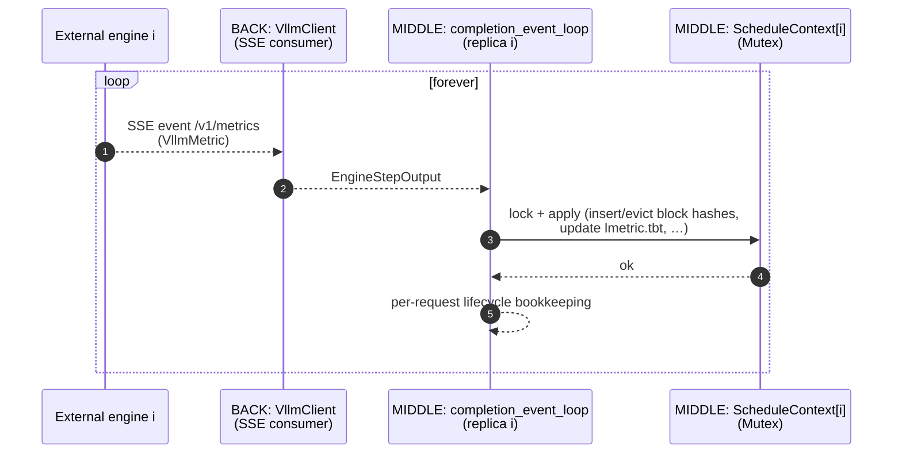
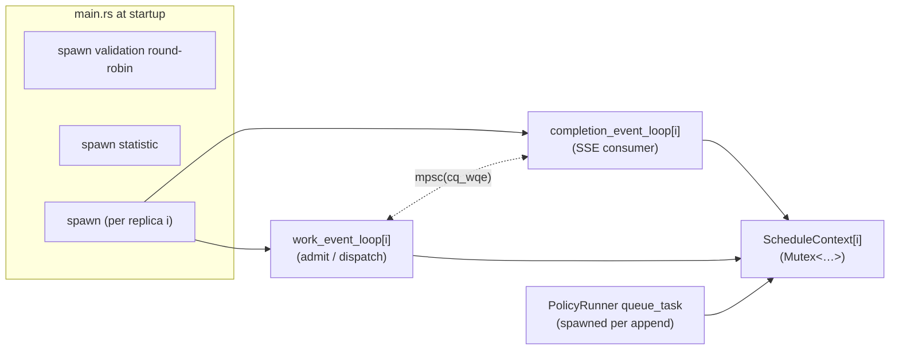
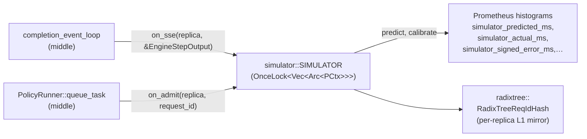

# Architecture

A 10,000-foot view of `blitz-router`'s components and how they wire together.
This is a companion to `CLAUDE.md` (which is the operational reference) — if
you have never read this codebase before, start here.

> Renderers: every `mermaid` block below renders on GitHub, GitLab, mdBook,
> and Obsidian. Plain `cmark` will show them as fenced code; that is
> acceptable but you lose the diagrams.

> The three-layer view in §2 is the **conceptual** architecture. The
> on-disk layout under `router/src/` does not yet reflect it (everything
> is currently flat). Bringing the file tree into alignment with these
> layers is tracked as a separate refactor in
> [`refactor-plan.md`](refactor-plan.md).

## 1. System boundary

`blitz-router` is **only the routing layer**. It exchanges traffic with two
classes of external counterparts — neither lives in this repo, neither is
part of the system this document describes:

- **Inbound**: HTTP clients (OpenAI-style chat-completions or `/generate`).
- **Outbound**: inference engines, addressed over HTTP for `/generate` and
  subscribed over Server-Sent Events on `/v1/metrics`.



- **HTTP request path** (solid lines): a client request enters at the
  gateway, is admitted by the scheduler, and is dispatched by the
  engine driver to one external engine; the streamed response flows
  back the same way.
- **SSE metrics path** (dotted line): every engine pushes one event per
  forward step on its `/v1/metrics` endpoint. The engine driver
  consumes all engines' streams concurrently and forwards the unified
  `EngineStepOutput` to the scheduler. **No gRPC anywhere.**

The three layers and their internals are detailed in §2 onward.

For concreteness: in lmetric the inbound clients are typically
`request-sim` (a Rust load generator) and the outbound engines are
`yaullm` (a patched vLLM). End-to-end paper experiments are orchestrated
by [MetricsTestRunner](https://github.com/blitz-serving/MetricsTestRunner).
None of these are part of `blitz-router` and none appear elsewhere in
this document's diagrams — they are listed here only so you know where
the live traffic actually originates and terminates.

## 2. Three-layer architecture

The system decomposes into three layers, each with a single
responsibility and a thin contract to the next.

### Reading the diagrams

Every diagram in this document follows two visual conventions, used
together to keep **containment** ("A is part of B") and **wiring**
("data flows between A and B") readable on the same picture:

- **Containment** is shown by **subgraph nesting**. If module `M` lives
  visually inside subgraph `L`, it is part of layer `L`. If state
  block `S` lives inside `Infer`, then `Infer` owns it. Nested
  subgraphs are nested ownership.
- **Wiring** is shown by **arrows**, with the kind of relationship
  encoded in the arrow style:

  | Style                | Meaning                                   |
  |----------------------|-------------------------------------------|
  | `==>` (solid thick)  | hot-path data flow (the request lifecycle / reply stream) |
  | `-->` (solid thin)   | call / control transfer                   |
  | `-.->` (dashed)      | shared `Arc` reference, read-only access, or out-of-band observation (simulator piggyback) |
  | label on the arrow   | the type that crosses, or the operation invoked |

Arrows always go between specific module nodes — never between layer
subgraphs in the abstract — so you can read off WHICH module on the
source side talks to WHICH module on the destination side.

### Layer overview



**Layer responsibilities**:

| Layer | What it owns | What it knows nothing about |
|---|---|---|
| **Front (Gateway)** | HTTP framing, OpenAI-compatible API surface, tokenizer rendering, request validation | which replica will run the request, how the engine speaks |
| **Middle (Scheduler)** | Admission, replica selection (policies), KV-cache state per replica, the dispatch loop, the SSE-consumption loop | HTTP wire format, the engine's transport (sees `EngineClient` trait only) |
| **Back (Engine driver)** | Engine transports (HTTP+SSE today, ZMQ alternative), translation between unified types (`EngineStepOutput`) and wire-specific payloads | scheduling policy, request validation, tokenization |

**Contract between layers** (the only types that cross):

| Boundary | Surface |
|---|---|
| Front → Middle | `ValidGenerateRequest` + a `mpsc::UnboundedSender<Result<InferStreamResponse, _>>` per request, packaged into a queued `Entry` |
| Middle → Back | `engine::EngineClient::add_request(req) -> Future<()>` (one direction) and `engine::EngineStepReceiver::recv_step() -> Future<EngineStepOutput>` (the other direction) |

These two surfaces are the only places the layers touch. Everything
else is internal to its layer.

## 3. Workspace layout

`blitz-router` is a Cargo workspace with five members:

| Member         | Role                                                          | Loaded by         |
|----------------|---------------------------------------------------------------|-------------------|
| `router/`      | The router itself: all three layers above                     | top-level binary  |
| `radixtree/`   | Patricia-trie crate (`BlockHash` trait + production impl + Verus L0 spec + L0..L3 lowering bench ladder) | `router/` middle layer |
| `policy-dsl/`  | Proc macro `policy! { … }` that lowers a DSL spec into `impl Policy for X` | `router/` middle layer |
| `rust-proto/`  | Protobuf type definitions used as **internal Rust types** (NOT a wire protocol) | `router/` |
| `request-sim/` | Git submodule — Rust load generator. Lives in this workspace only because the Cargo workspace lets developers `cargo run -p request-sim` from one checkout | standalone binary |



## 4. Front layer — Gateway

**Responsibility**: be the HTTP face of the system. Accept OpenAI-style
and TGI-style requests, validate them, render chat templates, hand off
a `ValidGenerateRequest` plus a response channel to the scheduler.

| Module (current path) | Role                                                                          | LOC  |
|-----------------------|-------------------------------------------------------------------------------|------|
| `server.rs`           | Axum router. Endpoints: `/generate`, `/generate_stream`, `/v1/chat/completions`, `/info`, `/health`, `/metrics`, `/invocations` | 1143 |
| `validation.rs`       | `Validation` — fan-out of CPU-bound tokenization to a thread pool via `spawn_blocking`; round-robin task; produces `ValidGenerateRequest` | 467  |
| `chat_template.rs`    | Chat template rendering (Jinja-style or PyO3-backed when feature `python-chat-template` is on) | 340  |
| `model_config.rs`     | Auto-discovery of `config.json` / `tokenizer_config.json` at startup          | 81   |
| `health.rs`           | Health endpoint logic                                                         | 11   |

The gateway exposes **one** outbound surface: it calls
`Infer::generate(ValidGenerateRequest) -> impl Stream<InferStreamResponse>`.
That single call is the entire contract to the scheduler.

## 5. Middle layer — Scheduler

**Responsibility**: decide which replica runs each request, drive the
work, and maintain per-replica state (KV-cache view + load metrics).
This is by far the biggest layer.

| Module (current path) | Role                                                                          | LOC  |
|-----------------------|-------------------------------------------------------------------------------|------|
| `infer.rs`            | `Infer` struct — central orchestrator. Owns validation, queue, ColocationController, the concurrency `Semaphore`. Public method `generate(req)` is the gateway-facing handle. | 530  |
| `queue.rs`            | 8-line shim — re-exports `Entry`, `QueuePro`, `TaskAssigner` from `policies/`. Queue logic itself lives in `policies/policy_runner.rs`. | 8    |
| `colocation.rs`       | `ColocationController` + the two per-replica async loops: `work_event_loop` (admit + dispatch) and `completion_event_loop` (consume engine SSE) | 1105 |
| `kvcache.rs`          | `BlockHashState` (per-request prefix hash builder), `mod hashtable_block_hash` (alternative `BlockHash` impl selected by the `hashtable-blockhash` feature), the feature-gated `PrefixBlockHash` re-export | 1130 |
| `metrics.rs`          | `LMetric` per-replica scheduling counters, `ScheduleContext` (replica state = `LMetric` + `PrefixBlockHash`), tunable constants for policies (`BAILIAN_*`, `MOST_HIT_LOAD_*`, …). **Note**: this `metrics.rs` is unrelated to the Prometheus crate also called `metrics` — see refactor-plan.md for the rename | 216  |
| `statistic.rs`        | Statistics task spawned by `Infer` to dump `ScheduleContext` periodically     | 47   |
| `policies/`           | DSL-driven scheduling policies (18 of them, one per upstream baseline). One Cargo feature flag selects the active policy at compile time | dir  |
| `simulator/`          | Latency simulator (feature `simulator`). Piggyback observer over the active policy. Uses `radixtree::RadixTreeReqIdHash` for its L1 mirror | dir  |

Scheduler-internal containment + wiring:



How to read PolicyRunner's three roles off this picture:

1. **It is an SPMC queue.** Read it as: one `queue_task` producer
   feeds `pr_buf`, which fans out to N `work_event_loop[i]` consumers
   via `next_request(replica_i)`. The `pr_buf` node carries the
   `★ ROLE: SPMC queue` annotation precisely so this fan-out is
   readable.
2. **It owns the kvcache (via shared `Arc`).** The `PolicyRunner` and
   the `ColocationController` both hold `Arc` clones into the same
   `state` block (`Vec<Arc<Mutex<ScheduleContext>>>`). The
   `ScheduleContext` contains both `LMetric` and `PrefixBlockHash`
   (the kvcache trie). Visible via the two dashed `Arc clone` arrows.
3. **It is wired to engine SSE — through the shared state.** Trace the
   SSE chain on the diagram: external engine → `b_vllm.recv_step` →
   `cc_done` → `WRITE` into `state` → `pr_dec` `READ` from `state`.
   The wiring is *indirect*: PolicyRunner does not subscribe to SSE
   itself; it sees the engine's effects by reading state that the
   completion loop is the SOLE writer of.

Two scheduler-internal invariants that fall out of the picture:
- **`completion_event_loop` is the only writer to
  `ScheduleContext.block_hash`** — only `cc_done` has a thick `WRITE`
  arrow into `state`. Every other access is dashed (`READ` or
  `Arc clone`).
- **Policies are picked at compile time.** Exactly one `<name>-q`
  Cargo feature is enabled per build → exactly one
  `TaskAssigner = PolicyRunner<XQ>` alias is monomorphised into the
  binary. There is no runtime policy switching.

### 5.1. The `Policy` abstraction

Every policy implements one trait:

```rust
// Currently at: router/src/policies/policy_trait.rs
// (in the refactor: router/src/scheduler/policies/policy_trait.rs)
pub trait Policy {
    type GlobalContext: Default + Send + Sync + 'static;

    fn schedule<'a>(
        entry: &'a Entry,
        all_sctx: &'a [Arc<Mutex<ScheduleContext>>],
        gctx: &'a mut Self::GlobalContext,
    ) -> impl Future<Output = Option<usize>> + Send + 'a;
}
```

You don't write this `impl` by hand. You write a DSL spec and the
`policy! { … }` proc macro from `policy-dsl/` lowers it. Example
(`router/src/policies/lmetric.rs`):

```text
policy lmetric-q (gctx: ()):
    Select min by sctx.prefill_tokens(req) · (sctx.bs + 1)
    after: default
```

The spec form is documented in `docs/dsl/policies.md` §2. The lowering
table (DSL → Rust) is in `docs/dsl/implementation.md` §2.1.

`PolicyRunner<P: Policy>` (`policy_runner.rs`) is the generic shim that:
1. Owns the per-replica commit buffers (lossless admission).
2. Spawns one `queue_task` per `append()` call.
3. Calls `P::schedule(...)` and pushes the entry into the chosen
   replica's buffer.

## 6. Back layer — Engine driver

**Responsibility**: speak the engine's wire protocol. Translate the
scheduler's abstract `add_request` / `recv_step` calls into HTTP+SSE
(or ZMQ) traffic against the external engines.

| Module (current path)  | Role                                                                          | LOC  |
|------------------------|-------------------------------------------------------------------------------|------|
| `engine_client.rs`     | The `EngineClient` + `EngineStepReceiver` traits + the unified `EngineStepOutput` type. The single point of dispatch from middle to back | 518  |
| `vllmlet.rs`           | `VllmClient` — reqwest-based HTTP client to a single engine; `/v1/metrics` SSE consumer that yields `VllmMetric` | 309  |
| `zmq_engine.rs`        | Alternate ZMQ transport (feature-gated `zmq-backend`)                          | 595  |

Two adapters, one trait — the trait is the layer's only contract
surface and the impls are containment-equal siblings under it:



The trait surface is small enough to quote in full:

```rust
// engine_client.rs
pub trait EngineClient: Send {
    async fn add_request(&mut self, req: ValidGenerateRequest) -> Result<(), EngineClientError>;
    async fn abort_request(&mut self, id: u64) -> Result<(), EngineClientError>;
    fn get_error_rx(&mut self) -> mpsc::UnboundedReceiver<u64>;
    fn take_step_receiver(&mut self) -> Box<dyn EngineStepReceiver>;
}

pub trait EngineStepReceiver: Send {
    async fn recv_step(&mut self) -> Result<EngineStepOutput, EngineClientError>;
}
```

Adding a new engine transport = `impl`-ing this trait. The scheduler
needs zero changes.

## 7. Request lifecycle (across layers)

End-to-end happy path, `POST /v1/chat/completions` to streamed
response. The colours match §2's layer palette.



## 8. Engine SSE consumption (the second half)

In parallel with the request path, every replica has a **second** async
task in the middle layer pulling SSE events from the back layer:



Why this matters:
- The router's view of "what's in each replica's KV cache" — the
  `radixtree::RadixTreeBlockHash` inside `ScheduleContext.block_hash` —
  is updated **only** here. Scheduling policies read this state when
  picking a replica.
- The completion loop is the SOLE writer to `ScheduleContext.block_hash`.
  The work loop and the policy hot path are readers (under the same
  `Mutex`).
- The completion loop also drives the simulator's piggyback hook
  (`simulator::on_sse`) when feature `simulator` is enabled.

## 9. Cargo features as wiring switches

Several features rewire components at compile time. The complete list:

| Feature                     | Switches                                      | Layer |
|-----------------------------|-----------------------------------------------|-------|
| `radixtree-blockhash` *(default)* | `PrefixBlockHash = radixtree::RadixTreeBlockHash` | middle |
| `hashtable-blockhash`       | `PrefixBlockHash = HashTableBlockHash`        | middle |
| `default-hash-algo` *(default)* | `BackendBlockHash = [u64; 1]`                | middle |
| `sha256-hash-algo`          | `BackendBlockHash = [u64; 4]`                 | middle |
| `vllm-backend` *(default)*  | enables `VllmClient` (HTTP+SSE)               | back   |
| `zmq-backend`               | enables `ZmqEngineClient`                     | back   |
| `<name>-q` (one of 18)      | selects `TaskAssigner = PolicyRunner<XQ>`     | middle |
| `simulator`                 | builds the `simulator/` subsystem; piggyback observer activates only if `--enable-simulator` is also passed at runtime | middle |
| `python-chat-template`      | enables PyO3-based chat template renderer     | front  |
| `ngrok` *(default)*         | exposes the server through ngrok              | front  |

Rule of thumb: anything in the table swaps a concrete impl behind a
trait or type alias. There are no runtime-config branches for these.

## 10. Concurrency model

### Tasks per replica (n = number of engines)



### Channels and locks

| Object | Type | Producers | Consumers |
|---|---|---|---|
| `Entry`'s `response_tx` | `mpsc::UnboundedSender<Result<InferStreamResponse, _>>` | per-replica work loops, completion loop | `Infer::generate` (per request) |
| `cq_wqe` (per replica) | `mpsc::Receiver<Entry>` | `PolicyRunner::queue_task` | `completion_event_loop` |
| `cq_error` (per replica) | `mpsc::UnboundedReceiver<u64>` | `EngineClient::get_error_rx()` | `completion_event_loop` |
| `all_commit_req_buffers[i]` | `VecDeque<(u64, Entry)>` (NO mutex — owned exclusively by `PolicyRunner::queue_task`) | filled by the `Append` branch of `queue_task` | drained by the `NextRequest` branch of `queue_task` (called from `work_event_loop[i]`) |
| `ScheduleContext[i]` | `Arc<Mutex<…>>` | completion loop (writes), work loop + policy (read/update) | as above |
| `RadixTreeBlockHash::mtx` | internal `SpinLock` | inside `radixtree::block_hash` only | inside the same |
| `Semaphore` | `Arc<tokio::sync::Semaphore>` | every accepted request decrements | every finished request increments |

Two invariants worth knowing:
- **`completion_event_loop` is the only writer to a replica's
  `ScheduleContext.block_hash`.**
- **One `Entry` lives in exactly one place at a time.** It is produced
  by `Validation`, owned by `PolicyRunner`'s commit buffer, then by
  the work loop's `entries` map, then dropped after the engine reports
  finish. Lifetime tracking is via `request_id` in debug asserts.

## 11. Optional: the latency simulator

When built with `--features simulator,<name>-q` AND launched with
`--enable-simulator`, the simulator (a middle-layer subsystem) observes
— but does not influence — routing:



The mirror tracks per-request prefix membership (V = `ReqId`), distinct
from the engine's KV cache (V = `Bids`) tracked inside
`ScheduleContext.block_hash`. Both are radix tries, but the use cases —
multi-bid concurrent engine cache vs. simulator's in-flight reasoning
— have non-overlapping requirements, so they live as different
specializations inside the `radixtree` crate.

Design rationale for the three-layer `PCtx`, the calibration
loop, and the future `simulator-q` policy is in
`.claude/memory/project_lmetric_predictor_design.md`.

## 12. Where to go next

| You want to … | Read |
|---|---|
| Bring the directory layout into alignment with the three-layer model above | [`refactor-plan.md`](refactor-plan.md) |
| Add a new scheduling policy | `docs/dsl/policies.md` + invoke the `/add-policy` skill |
| Verify a policy spec matches its impl | invoke `/verify-policy` |
| Build / run end-to-end experiments | the [MetricsTestRunner](https://github.com/blitz-serving/MetricsTestRunner) repo |
| Understand the radix tree's verified-then-lowered chain | `radixtree/README.md` |
| Look up a specific configuration knob | `CLAUDE.md` §"Configuration" |
| Trace what a `policy! { … }` body lowers into | `docs/dsl/implementation.md` §2.1 |

The TLA+ specification for the colocation/CompletionLoop entry lifecycle
lives in `formal/tlaplus/`. It is not policy logic — it models the
work-loop ↔ completion-loop handoff to catch order-dependent races.
