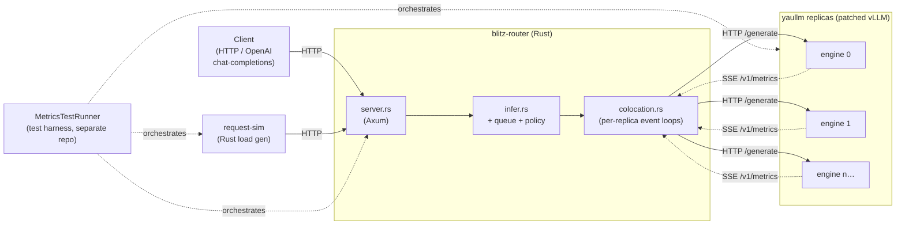
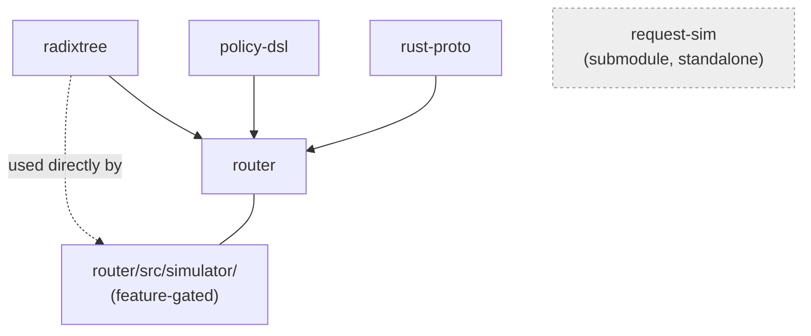
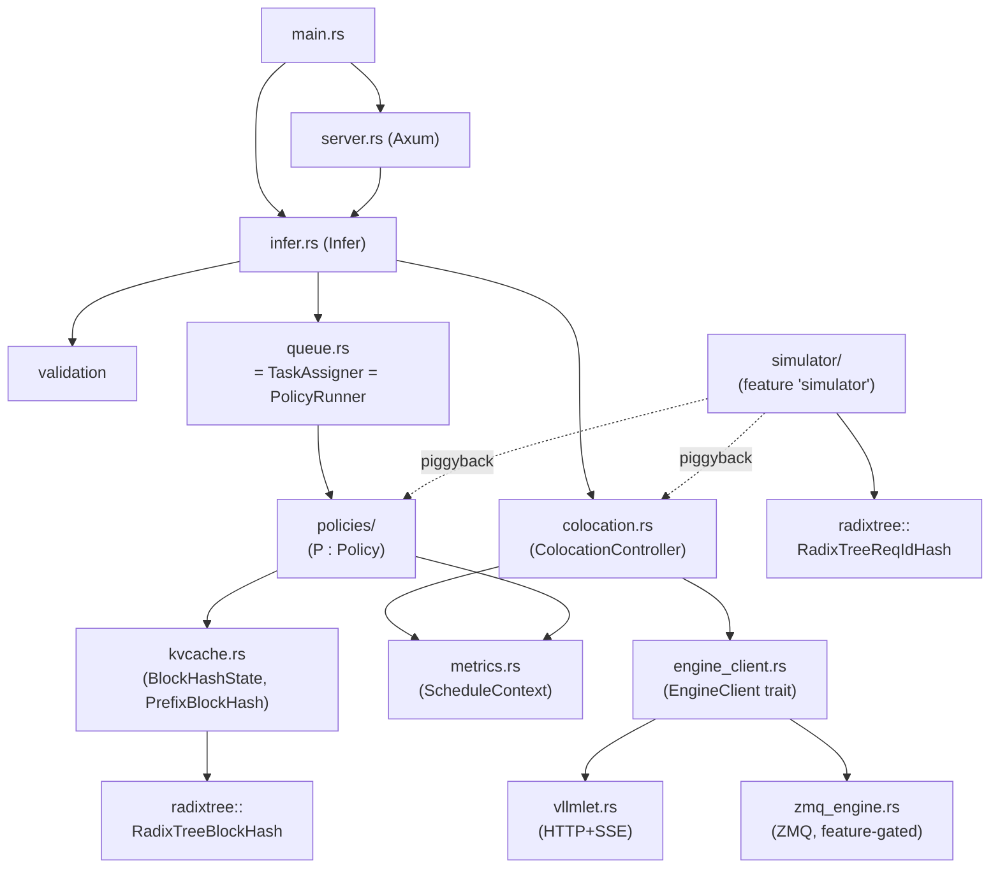
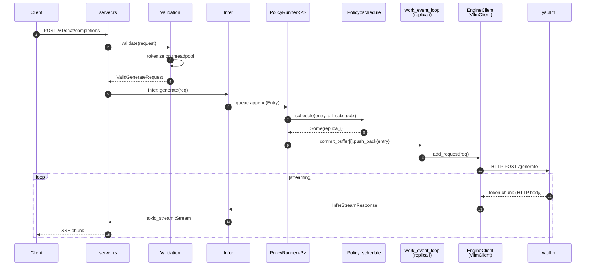
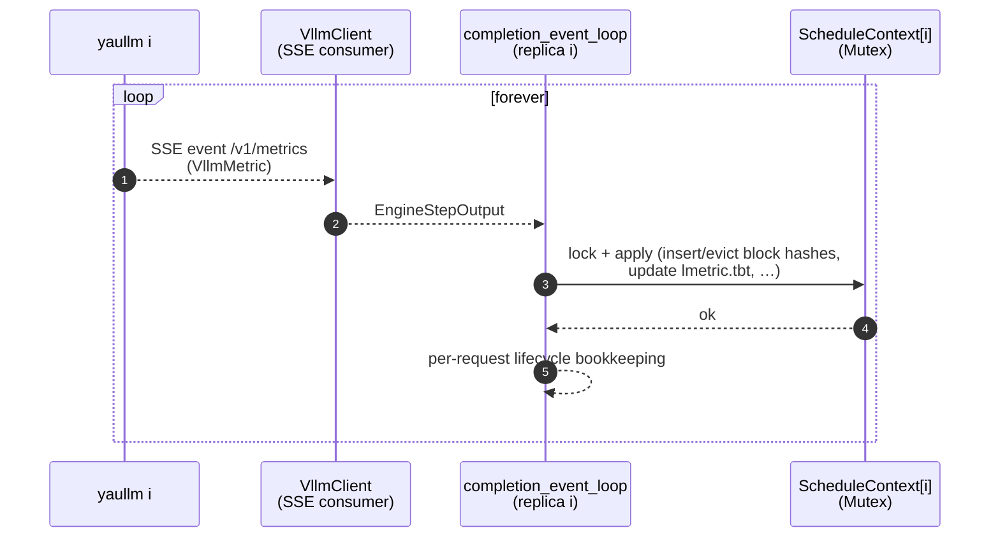
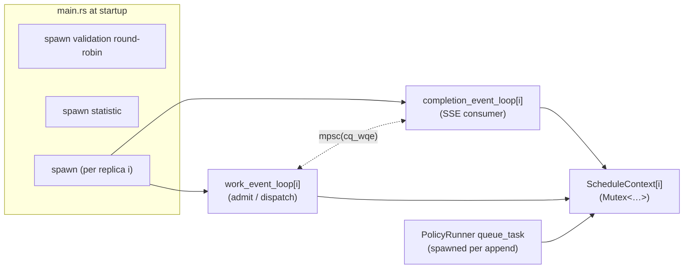
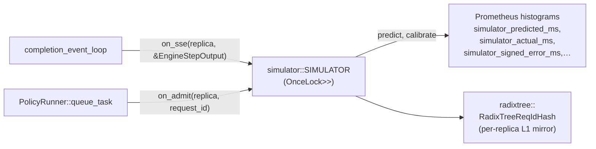

# Architecture

A 10,000-foot view of `blitz-router`'s components and how they wire together.
This is a companion to `CLAUDE.md` (which is the operational reference) — if
you have never read this codebase before, start here.

> Renderers: every `mermaid` block below renders on GitHub, GitLab, mdBook,
> and Obsidian. Plain `cmark` will show them as fenced code; that is
> acceptable but you lose the diagrams.

## 1. Where blitz-router fits in lmetric

`blitz-router` is **only the routing layer**. It cannot run standalone.
A working lmetric deployment needs three independent repos cooperating:



- **HTTP request path** (solid lines): client → router → engine, response
  streams back the same way.
- **SSE metrics path** (dotted lines): each engine pushes one event per
  forward step on its `/v1/metrics` endpoint; the router consumes all of
  them concurrently. **No gRPC anywhere.**
- **`MetricsTestRunner`** is a separate repo
  ([github.com/blitz-serving/MetricsTestRunner](https://github.com/blitz-serving/MetricsTestRunner))
  that orchestrates `yaullm + blitz-router + request-sim` for paper
  experiments. It is not a runtime component.

## 2. Workspace layout

`blitz-router` is a Cargo workspace with five members:

| Member         | Role                                                          | Loaded by         |
|----------------|---------------------------------------------------------------|-------------------|
| `router/`      | The router itself: HTTP server, scheduler, engine client      | top-level binary  |
| `radixtree/`   | Patricia-trie crate (`BlockHash` trait + production impl + Verus L0 spec + L0..L3 lowering bench ladder) | `router/`         |
| `policy-dsl/`  | Proc macro `policy! { … }` that lowers a DSL spec into `impl Policy for X` | `router/policies/` |
| `rust-proto/`  | Protobuf type definitions used as **internal Rust types** (NOT a wire protocol) | `router/`         |
| `request-sim/` | Git submodule — Rust load generator. Lives in this workspace only because the Cargo workspace lets developers `cargo run -p request-sim` from one checkout | standalone binary |

Dependency direction (only routing-relevant arrows):



## 3. Inside `router/src/`

Every module shipped in the binary, by responsibility area:

| Module                | Responsibility                                                                 |
|-----------------------|--------------------------------------------------------------------------------|
| `main.rs`             | CLI parsing (clap), tokenizer load, engine-client construction, `Infer::create_vllm_colocation`, axum server bind |
| `lib.rs`              | Crate root: shared API types (`GenerateRequest`, `ChatMessage`, `Info`, …), module declarations |
| `server.rs`           | Axum server. Routes: `/generate`, `/generate_stream`, `/v1/chat/completions`, `/info`, `/health`, `/metrics`, `/invocations` |
| `validation.rs`       | `Validation` — fan-out of CPU-bound tokenization to a thread pool via `spawn_blocking`; round-robin task |
| `infer.rs`            | `Infer` struct — the central orchestrator. Owns `validation`, `queue`, `ColocationController`, the concurrency `Semaphore` |
| `queue.rs`            | Tiny shim — re-exports `Entry`, `QueuePro`, `TaskAssigner` from `policies/`. Queue logic itself lives in `policies/policy_runner.rs` |
| `policies/`           | DSL-driven scheduling policies (18 of them, one per upstream baseline). One Cargo feature flag selects the active policy at compile time |
| `kvcache.rs`          | `BlockHashState` (per-request prefix hash builder), `HashTableBlockHash` (alt prefix matcher selected by `hashtable-blockhash` feature), `PrefixBlockHash` re-export |
| `colocation.rs`       | `ColocationController` + the two per-replica async loops: `work_event_loop` (admit + dispatch) and `completion_event_loop` (consume engine SSE) |
| `engine_client.rs`    | `EngineClient` + `EngineStepReceiver` traits + two implementations (HTTP+SSE via `VllmClient`, ZMQ via `ZmqEngineClient`) + the unified `EngineStepOutput` type |
| `vllmlet.rs`          | `VllmClient` — reqwest-based HTTP client to a single yaullm; `/v1/metrics` SSE consumer that yields `VllmMetric` |
| `zmq_engine.rs`       | Alternate ZMQ transport (feature-gated `zmq-backend`)                          |
| `metrics.rs`          | `ScheduleContext` (per-replica live state: `LMetric` + `PrefixBlockHash`), Prometheus counters, replica state enum |
| `chat_template.rs`    | Chat template renderer (Jinja-style)                                            |
| `model_config.rs`     | Auto-discovery of `config.json` / `tokenizer_config.json`                       |
| `simulator/`          | Latency simulator (feature `simulator`); piggyback observer over the active policy |
| `health.rs`, `error.rs`, `statistic.rs` | self-explanatory                                                              |

Inside-the-binary dependency arrows (skipping leaves like `error.rs`):



The hard separations to keep in mind:
- **`engine_client.rs`** is the only place the router talks to engines.
  Anything that needs to reach yaullm goes through `EngineClient`.
- **`policies/`** is the only place where replica selection happens. The
  rest of the system handles it as a black-box `TaskAssigner`.
- **`radixtree`** is the only crate that knows what a Patricia trie is.
  `kvcache.rs` consumes it through the `BlockHash` trait.

## 4. Request lifecycle

End-to-end happy path, from `POST /v1/chat/completions` to streamed
response:



A few things to notice:
- Step 5 (`Pr → Po`) is the one place where scheduling policy decides which
  replica to use. Returning `None` means cluster overload.
- Steps 7 → 9 cross from the "frontend" half (request-side) to the
  "backend" half (engine-side). The handoff is the
  `commit_buffer[replica_i]` channel inside `PolicyRunner`.
- Steps 10-13 happen N times, one per generated token. `Infer` owns the
  outbound `mpsc::UnboundedSender` per `Entry`.

## 5. Engine SSE consumption (the second half)

In parallel with the request path, every replica has a **second** async
task pulling SSE events from yaullm:



Why this matters:
- The router's view of "what's in each replica's KV cache" — the
  `radixtree::RadixTreeBlockHash` inside `ScheduleContext.block_hash` —
  is updated **only** here. Scheduling policies read this state when
  picking a replica.
- The completion loop is the SOLE writer to `ScheduleContext.block_hash`.
  The work loop and the policy hot path are readers (under the same
  `Mutex`).
- The completion loop also drives the simulator's piggyback hook
  (`simulator::on_sse`) when feature `simulator` is enabled.

## 6. Scheduling: the `Policy` abstraction

Every policy implements one trait:

```rust
// router/src/policies/policy_trait.rs
pub trait Policy {
    type GlobalContext: Default + Send + Sync + 'static;

    fn schedule<'a>(
        entry: &'a Entry,
        all_sctx: &'a [Arc<Mutex<ScheduleContext>>],
        gctx: &'a mut Self::GlobalContext,
    ) -> impl Future<Output = Option<usize>> + Send + 'a;
}
```

You don't write this `impl` by hand. You write a DSL spec and the
`policy! { … }` proc macro from `policy-dsl/` lowers it. Example
(`router/src/policies/lmetric.rs`):

```text
policy lmetric-q (gctx: ()):
    Select min by sctx.prefill_tokens(req) · (sctx.bs + 1)
    after: default
```

The spec form is documented in `docs/dsl/policies.md` §2. The lowering
table (DSL → Rust) is in `docs/dsl/implementation.md` §2.1.

`PolicyRunner<P: Policy>` (`policy_runner.rs`) is the generic shim that:
1. Owns the per-replica commit buffers (lossless admission).
2. Spawns one `queue_task` per `append()` call.
3. Calls `P::schedule(...)` and pushes the entry into the chosen
   replica's buffer.

Exactly **one** policy is selected per build via cargo features. The
selection is also where compile-time monomorphization happens —
`TaskAssigner = PolicyRunner<P>` is a concrete type aliased once:

```rust
// router/src/policies/mod.rs (excerpt)
#[cfg(feature = "lmetric-q")]
pub(crate) type TaskAssigner = PolicyRunner<LmetricQ>;
#[cfg(feature = "dynamo-q")]
pub(crate) type TaskAssigner = PolicyRunner<DynamoQ>;
// … 16 more …
// `join-shortest-weight-q` is the catch-all default when no
// policy-q feature is enabled.
```

## 7. Cargo features as wiring switches

Several features rewire components at compile time. The complete list:

| Feature                     | Switches                                      |
|-----------------------------|-----------------------------------------------|
| `radixtree-blockhash` *(default)* | `PrefixBlockHash = radixtree::RadixTreeBlockHash` |
| `hashtable-blockhash`       | `PrefixBlockHash = HashTableBlockHash`        |
| `default-hash-algo` *(default)* | `BackendBlockHash = [u64; 1]`                |
| `sha256-hash-algo`          | `BackendBlockHash = [u64; 4]`                 |
| `vllm-backend` *(default)*  | enables `VllmClient` (HTTP+SSE)               |
| `zmq-backend`               | enables `ZmqEngineClient`                     |
| `<name>-q` (one of 18)      | selects `TaskAssigner = PolicyRunner<XQ>`     |
| `simulator`                 | builds the `simulator/` subsystem; piggyback observer activates only if `--enable-simulator` is also passed at runtime |
| `python-chat-template`      | enables PyO3-based chat template renderer     |
| `ngrok` *(default)*         | exposes the server through ngrok              |

Rule of thumb: anything in the table swaps a concrete impl behind a
trait or type alias. There are no runtime-config branches for these.

## 8. Concurrency model

### Tasks per replica (n = number of yaullm engines)



### Channels and locks

| Object | Type | Producers | Consumers |
|---|---|---|---|
| `Entry`'s `response_tx` | `mpsc::UnboundedSender<Result<InferStreamResponse, _>>` | per-replica work loops, completion loop | `Infer::generate` (per request) |
| `cq_wqe` (per replica) | `mpsc::Receiver<Entry>` | `PolicyRunner::queue_task` | `completion_event_loop` |
| `cq_error` (per replica) | `mpsc::UnboundedReceiver<u64>` | `EngineClient::get_error_rx()` | `completion_event_loop` |
| `all_commit_req_buffers[i]` | `VecDeque<(u64, Entry)>` (NO mutex — owned exclusively by `PolicyRunner::queue_task`) | filled by the `Append` branch of `queue_task` | drained by the `NextRequest` branch of `queue_task` (called from `work_event_loop[i]`) |
| `ScheduleContext[i]` | `Arc<Mutex<…>>` | completion loop (writes), work loop + policy (read/update) | as above |
| `RadixTreeBlockHash::mtx` | internal `SpinLock` | inside `radixtree::block_hash` only | inside the same |
| `Semaphore` | `Arc<tokio::sync::Semaphore>` | every accepted request decrements | every finished request increments |

Two invariants worth knowing:
- **`completion_event_loop` is the only writer to a replica's
  `ScheduleContext.block_hash`.** Every reader takes the same `Mutex`.
- **One `Entry` lives in exactly one place at a time.** It is produced
  by `Validation`, owned by `PolicyRunner`'s commit buffer, then by
  the work loop's `entries` map, then dropped after the engine reports
  finish. Lifetime tracking is via `request_id` in debug asserts.

## 9. Optional: the latency simulator

When built with `--features simulator,<name>-q` AND launched with
`--enable-simulator`, the simulator observes — but does not influence —
routing:



The mirror tracks per-request prefix membership (V = `ReqId`), distinct
from the engine's KV cache (V = `Bids`) tracked inside
`ScheduleContext.block_hash`. Both are radix tries, but the use cases —
multi-bid concurrent engine cache vs. simulator's in-flight reasoning
— have non-overlapping requirements, so they live as different
specializations inside the `radixtree` crate.

Design rationale for the three-layer `PCtx`, the calibration
loop, and the future `simulator-q` policy is in
`.claude/memory/project_lmetric_predictor_design.md`.

## 10. Where to go next

| You want to … | Read |
|---|---|
| Add a new scheduling policy | `docs/dsl/policies.md` + invoke the `/add-policy` skill |
| Verify a policy spec matches its impl | invoke `/verify-policy` |
| Build / run end-to-end experiments | the [`MetricsTestRunner`](https://github.com/blitz-serving/MetricsTestRunner) repo |
| Understand the radix tree's verified-then-lowered chain | `radixtree/README.md` |
| Look up a specific configuration knob | `CLAUDE.md` §"Configuration" |
| Trace what a `policy! { … }` body lowers into | `docs/dsl/implementation.md` §2.1 |

The TLA+ specification for the colocation/CompletionLoop entry lifecycle
lives in `formal/tlaplus/`. It is not policy logic — it models the
work-loop ↔ completion-loop handoff to catch order-dependent races.
