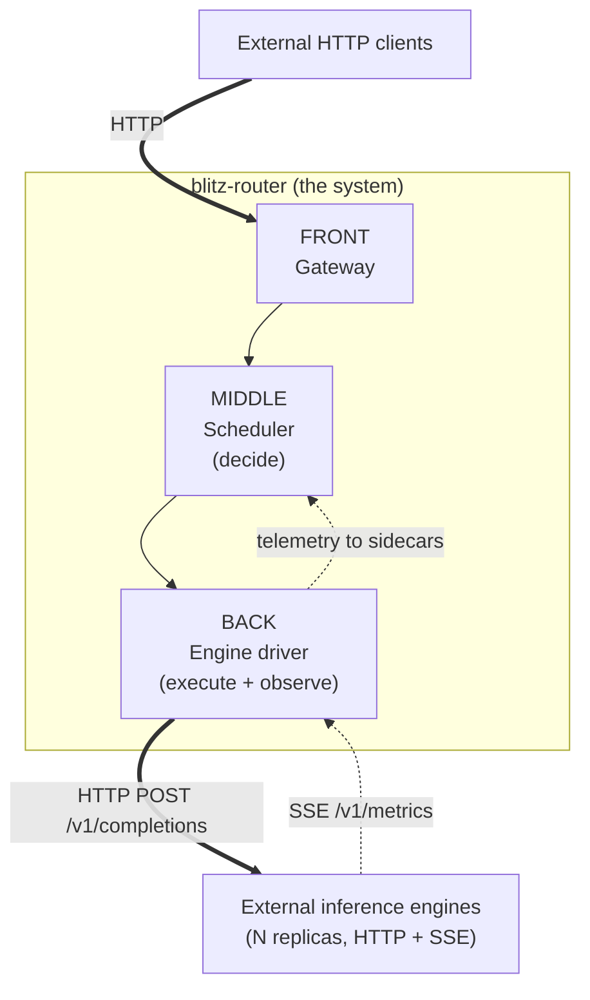
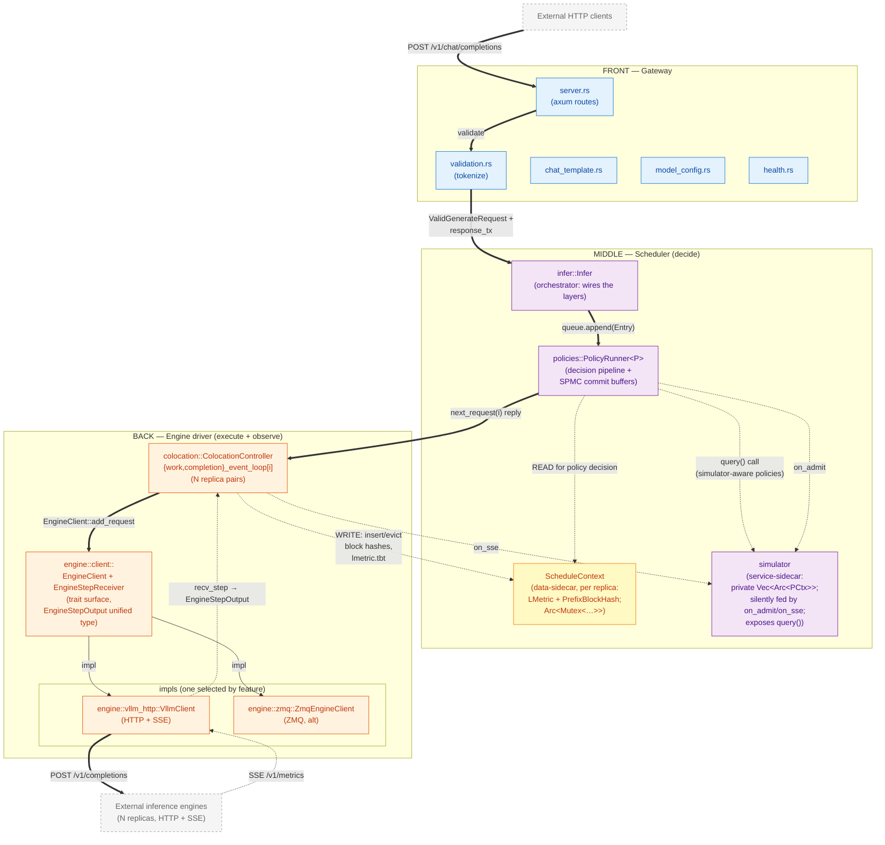

# blitz-router architecture

A 10,000-foot view of `blitz-router`'s components and how they wire
together. **Start here.** The detail for each layer / topic lives in
the per-topic files listed in §Index below.

> Renderers: every `mermaid` block below renders on GitHub, GitLab,
> mdBook, and Obsidian. Plain `cmark` will show them as fenced code;
> that is acceptable but you lose the diagrams.

> The three-layer view is mirrored on disk: `router/src/gateway/`,
> `router/src/scheduler/`, `router/src/engine/`. The original
> reorganization is documented in [`../refactor-plan.md`](../refactor-plan.md).

## Index

This file (`README.md`) covers the system boundary, the three-layer
architecture, the sidecar pattern, and the contracts between layers
— the concepts that everything else builds on. After reading this,
go to the per-topic file you need:

| Topic | File |
|---|---|
| Workspace members + Cargo features as wiring switches | [`workspace-and-features.md`](workspace-and-features.md) |
| FRONT (Gateway): HTTP framing, validation, chat templates | [`front-gateway.md`](front-gateway.md) |
| MIDDLE (Scheduler): PolicyRunner, sidecars, policy DSL | [`middle-scheduler.md`](middle-scheduler.md) |
| BACK (Engine driver): colocation, EngineClient adapters | [`back-engine-driver.md`](back-engine-driver.md) |
| Request lifecycle + SSE consumption (cross-layer flows) | [`request-lifecycle.md`](request-lifecycle.md) |
| Concurrency model (tasks, channels, locks, invariants) | [`concurrency-model.md`](concurrency-model.md) |
| Latency simulator (the service-sidecar) | [`latency-simulator.md`](latency-simulator.md) |

## 1. System boundary

`blitz-router` is **only the routing layer**. It exchanges traffic with two
classes of external counterparts — neither lives in this repo, neither is
part of the system this document describes:

- **Inbound**: HTTP clients using the OpenAI-compatible chat-completions
  API (`POST /v1/chat/completions`). The TGI-style URLs (`/`,
  `/generate`, `/generate_stream`, `/invocations`) are still bound but
  are **tombstoned** — they return `HTTP 410 Gone` with a JSON body
  pointing callers at the canonical OpenAI endpoint, so misdirected
  clients fail loudly instead of silently 404-ing.
- **Outbound**: inference engines, addressed over HTTP for
  `POST /v1/completions` (pre-tokenized token IDs over vLLM's
  OpenAI-compatible completions endpoint) and subscribed over
  Server-Sent Events on `/v1/metrics`.



- **HTTP request path** (solid lines): a client request enters at the
  gateway; the scheduler **decides** which replica should run it; the
  engine driver **executes** that decision against one external
  engine. The streamed response flows back the same way.
- **SSE metrics path** (dotted line): every engine pushes one event per
  forward step on its `/v1/metrics` endpoint. The engine driver
  consumes all engines' streams concurrently. **No gRPC anywhere.**
- **Telemetry back-flow** (dotted line, BACK → MIDDLE): the engine
  driver doesn't just consume SSE; it **writes the observed engine
  state** (cache contents, latency counters) back into per-replica
  *sidecars* that the scheduler reads on its next decision. This makes
  BACK both an executor and an observer; see §2.

For concreteness: in lmetric the inbound clients are typically
`request-sim` (a Rust load generator) and the outbound engines are
`yaullm` (a patched vLLM). End-to-end paper experiments are orchestrated
by [MetricsTestRunner](https://github.com/blitz-serving/MetricsTestRunner).
None of these are part of `blitz-router` and none appear elsewhere in
this document's diagrams — they are listed here only so you know where
the live traffic actually originates and terminates.

## 2. Three-layer architecture

The system decomposes into three layers, with a clean
**decide-vs-execute** split between MIDDLE and BACK and a **sidecar**
relationship for every piece of state the scheduler reads.

### 2.1. Reading the diagrams

Every diagram in this document set follows three visual conventions,
used together to keep **containment** ("A is part of B"), **wiring**
("data flows between A and B"), and **layer order** ("FRONT on top,
BACK on bottom") readable on the same picture:

- **Containment** is shown by **subgraph nesting**. If module `M` lives
  visually inside subgraph `L`, it is part of layer `L`. If state
  block `S` lives inside subsystem `X`, then `X` owns it. Nested
  subgraphs are nested ownership.
- **Wiring** is shown by **arrows**, with the kind of relationship
  encoded in the arrow style:

  | Style                | Meaning                                   |
  |----------------------|-------------------------------------------|
  | `==>` (solid thick)  | hot-path data flow (the request lifecycle / reply stream) |
  | `-->` (solid thin)   | call / control transfer                   |
  | `-.->` (dashed)      | shared `Arc` reference, sidecar read/write, or out-of-band observation (simulator piggyback) |
  | label on the arrow   | the type that crosses, or the operation invoked |
- **Layer order** is shown by **strict vertical stacking**. Every
  diagram that contains more than one of FRONT / MIDDLE / BACK MUST
  draw them as a top-to-bottom stack — FRONT on top, MIDDLE in the
  middle, BACK on the bottom. **Never side-by-side. Never triangular.**
  This matches the request-flow direction (top-down arrows) and the
  sidecar back-flow (bottom-up arrows) so the eye reads the data
  motion without re-orientation. Mechanically the discipline has four
  parts:
  1. The outermost diagram declares `flowchart TB` (or `graph TB`).
  2. Each layer subgraph uses `direction LR` internally so the layer
     renders as a *wide-and-short row* rather than a tall column —
     this is what keeps the vertical stack readable. Inner subgraphs
     (sidecars, adapters) may use `direction TB` for their own
     internal grouping; that is fine because they sit inside a layer
     row, not as their own row.
  3. The entire vertical chain — including external counterparts at
     the top and bottom — is pinned with invisible `~~~` edges
     (`InCli ~~~ FRONT ~~~ MIDDLE ~~~ BACK ~~~ OutEng`). This defeats
     mermaid's auto-layout from drifting into triangular arrangements
     when many cross-edges (especially BACK → MIDDLE sidecar writes)
     try to shorten themselves by pulling BACK alongside MIDDLE.
  4. **Subgraph-to-subgraph pins aren't enough — go node-to-node.**
     mermaid (via dagre) computes ranks per *node*, not per subgraph.
     With back-edges from BACK into MIDDLE (sidecar writes, `on_sse`
     hooks), dagre will pull some BACK node up to the same rank as a
     MIDDLE node to shorten the back-edge, and the two subgraphs
     will render side-by-side regardless of how many `~~~` chains
     between subgraph IDs you add. The fix is **node-level pins**
     from every MIDDLE-internal node (including sidecar contents) to
     BACK's boundary node `b_coloc`:
     ```
     m_infer  ~~~ b_coloc
     m_runner ~~~ b_coloc
     m_sim    ~~~ b_coloc
     sx_sched ~~~ b_coloc
     ```
     dagre reads each as "this MIDDLE node strictly precedes
     `b_coloc`," and the constraint then propagates through BACK's
     own forward chain (`b_coloc → b_trait → b_vllm/b_zmq`) so the
     entire BACK subgraph lands strictly below the entire MIDDLE
     subgraph. Cost: a handful of extra invisible edges per layering
     diagram. Benefit: the discipline survives even when sidecar
     back-flow, simulator hooks, and SSE return are all drawn in the
     same picture.

  New layering diagrams MUST follow this recipe. Do not let renderer
  convenience break the discipline.

Arrows always go between specific module nodes — never between layer
subgraphs in the abstract — so you can read off WHICH module on the
source side talks to WHICH module on the destination side.

### 2.2. The layer split: decide vs. execute

The split between MIDDLE and BACK is **decision vs. execution**, not
"is the data engine-shaped." Once you internalise this, every other
allocation in this document falls out.

| Layer | What it does | What it knows nothing about |
|---|---|---|
| **Front (Gateway)** | HTTP framing, OpenAI-compatible API surface, tokenizer rendering, request validation | which replica will run the request, how the engine speaks |
| **Middle (Scheduler)** | **Decide** which replica runs each request via `Policy::schedule(...)`. Read sidecar state — the `ScheduleContext` data-sidecar (kvcache view + load counters) directly, and the `simulator` service-sidecar via `query()` for simulator-aware policies — to inform the decision. Maintain the SPMC commit-buffer that the engine driver pulls from. Optionally host the `simulator` service-sidecar (which owns predictor state privately and is silently fed by `on_admit`/`on_sse`). | how the engine speaks, when an engine step starts/finishes, request-lifecycle bookkeeping |
| **Back (Engine driver)** | **Execute** the scheduler's decision: pull the routed `Entry` from the commit buffer, drive it through the engine via `EngineClient::add_request`, consume the engine's SSE step stream, own the in-flight request lifecycle, and **write the observed engine state back into the per-replica sidecar** (cache insertions/evictions, latency counters). Two engines = two adapters under the same trait. | scheduling policy logic, request validation, tokenization |

MIDDLE has no execution loop — it does not poll engines, does not
decide when to dispatch, does not own request lifecycle bookkeeping.
That all lives in BACK. BACK in turn has no policy logic — it does
not pick replicas, does not weigh load against cache hits. By the
time an `Entry` reaches a `work_event_loop[i]` in BACK, MIDDLE has
already committed it to replica `i`; BACK's only freedom is the
engine transport (HTTP+SSE today, ZMQ alternative).

### 2.3. The Sidecar pattern

The thing that makes the decide/execute split work is that whatever
state the scheduler reads is held in a **sidecar** beside
`PolicyRunner`, not inside it. The doc set uses "sidecar" for two
distinct flavors of the pattern, with different access shapes:

```
                  ┌────────────────────┐
                  │   PolicyRunner     │   ← MIDDLE: pure decision logic
                  │ (Policy::schedule) │
                  └─┬───────────────┬──┘
        READ direct │               │ READ via service call
                    ▼               ▼
       ┌────────────────────┐  ┌────────────────────┐
       │ ScheduleContext    │  │ simulator          │   ← service-sidecar
       │ (DATA-sidecar:     │  │ (private state:    │      (encapsulated;
       │  Arc<Mutex<…>>;    │  │   Vec<Arc<PCtx>>;  │       on_admit/on_sse
       │  fields exposed    │  │  silently event-fed│       are the silent
       │  to readers)       │  │  in the background)│       wiring)
       └─────────▲──────────┘  └────────▲───────────┘
                 │ WRITE                │ on_admit (from MIDDLE)
                 │                      │ on_sse  (from BACK)
       ┌─────────┴─────────┐
       │ BACK:             │
       │ completion_event_ │
       │ loop              │
       │ (sole writer)     │
       └───────────────────┘
```

Both flavors share the **silent-wiring property**: the writer feeds
the sidecar in the background. `PolicyRunner` never participates in
the write path; it only reads (data-sidecar) or calls
(service-sidecar) when it needs to decide.

What differs is the **access shape** — and that determines the
encapsulation choice:

| Flavor | Access | Example | Why this flavor fits |
|---|---|---|---|
| **Data-sidecar** | `PolicyRunner` reads the data structure directly via `Arc<Mutex<…>>`. The schema *is* the API. | `ScheduleContext` (per replica): `LMetric` + `PrefixBlockHash`. BACK's `completion_event_loop` is the sole writer; every `Policy::schedule(...)` reads it. | Policies routinely compare cache hits, batch sizes, prefill tokens — those *are* the fields. There is no useful service call to wrap them in; direct field access is the right encapsulation level. |
| **Service-sidecar** | `PolicyRunner` calls a method on the sidecar; its internal state is private. The consumer sees the contract, not the schema. | `simulator` (one runtime, holding `Vec<Arc<PCtx>>` per replica): each `PCtx` privately owns the L1 mirror (`RadixTreeReqIdHash` + per-request progress), L2 regressor, L3 ephemeral rollout. Silently fed by `on_admit` (from PolicyRunner's `queue_task`) and `on_sse` (from BACK's `completion_event_loop`). A simulator-aware policy will eventually call `simulator::query(replica, request_id, …)` to get a predicted-latency rollout. | The internal state is structurally complex — three predictor layers with their own calibration loops, plus a separate prefix mirror. Exposing it as `Arc<Mutex<PCtx>>` would tie every consumer to the simulator's internal schema, defeating the point of having the simulator as a separable subsystem. Behind `query()`, the implementation is free to evolve without breaking policies. |

The **service-sidecar's invariant** earns its keep: when `query()`
is called, the simulator has a "good" state because the silent wiring
(`on_admit`, `on_sse`) has been keeping it fresh in the background.
If the wiring breaks (e.g., `on_sse` stops firing), the predictor's
state goes stale but the service interface still returns *something*;
the contract is "we always return; freshness is best-effort." This
is why the simulator can be a piggyback observer without affecting
routing correctness — its outputs feed predictions, not mandates.

Why "sidecar" rather than "embedded fields on `PolicyRunner`"? (Same
three reasons apply to both flavors.)

1. **Lifecycle decoupling.** `PolicyRunner` does not write its own
   input. Whoever observes the engine (BACK) or simulates it
   (`simulator`) maintains the relevant sidecar; `PolicyRunner` only
   reads or calls.
2. **Replaceable / disable-able.** A scheduling policy that doesn't
   need predictions simply ignores the simulator service. Sidecars
   are feature-gated; the core decision loop is not.
3. **Concurrency model is just `Arc<…>` per consumer.** Data-sidecar
   uses `Arc<Mutex<T>>` (N replicas → N independent locks);
   service-sidecar uses an `Arc<Simulator>`-style shared service
   handle (today reified as a `OnceLock<SimulatorRuntime>` global,
   but the consumer-facing shape is the same). Either way the
   sidecar doesn't know how many readers/callers there are; the
   `Arc` is the contract.

The two flavors also have **different update schedules**:
`ScheduleContext` is updated on every engine step (high frequency,
low latency, BACK writes it directly off the SSE consumer); the
simulator's private state is updated on its own tick and on
engine-step-driven calibration (simulator-controlled, can lag
without affecting routing correctness).

### 2.4. Layer overview



### 2.5. Contracts between layers

These are the **only** types/calls that cross layer boundaries.
Everything else is internal to its layer.

| Boundary | Surface |
|---|---|
| Front → Middle | `ValidGenerateRequest` + `mpsc::UnboundedSender<Result<InferStreamResponse, _>>` per request, packaged into a queued `Entry`. Concretely, FRONT calls `Infer::generate(req)`; MIDDLE returns a `Stream`. |
| Middle → Back (forward) | BACK pulls work from MIDDLE: `PolicyRunner::next_request(replica_i) -> Future<Entry>`. The call drains one `Entry` from the per-replica commit buffer that `Policy::schedule(...)` filled. |
| Middle ↔ Back (sidecar) | `Arc<Mutex<ScheduleContext>>` per replica, shared between MIDDLE (reader; in `Policy::schedule`) and BACK (sole writer; in `completion_event_loop`). The `Arc` IS the contract — there is no setter or method, just shared lock-protected state. |
| Back → External engines | `EngineClient::add_request(req)` and `EngineStepReceiver::recv_step()`. This is the adapter-swap point (HTTP+SSE vs. ZMQ vs. anything new). |

Two consequences worth pinning:

- **Adding a new engine transport** = `impl EngineClient + EngineStepReceiver`. Neither MIDDLE nor `colocation` change. Just add a new adapter file alongside `engine/vllm_http.rs` / `engine/zmq.rs`.
- **Adding a new data-sidecar** = a new `Vec<Arc<Mutex<NewCtx>>>` + one writer (whatever subsystem produces the data) + N readers (whatever policies want it). PolicyRunner core stays untouched.
- **Adding a new service-sidecar** = a new subsystem that owns its private state, registers its silent-wiring callbacks, and exposes a service trait; consumers get an `Arc<NewService>`-style handle. PolicyRunner core still stays untouched.

## 3. Where to go next

| You want to … | Read |
|---|---|
| See how the on-disk three-layer reorg was carried out | [`../refactor-plan.md`](../refactor-plan.md) |
| Understand any single layer in depth | The per-topic file in §Index above |
| Add a new scheduling policy | [`../dsl/policies.md`](../dsl/policies.md) + invoke the `/add-policy` skill |
| Verify a policy spec matches its impl | invoke `/verify-policy` |
| Build / run end-to-end experiments | the [MetricsTestRunner](https://github.com/blitz-serving/MetricsTestRunner) repo |
| Understand the radix tree's verified-then-lowered chain | [`../../radixtree/README.md`](../../radixtree/README.md) |
| Look up a specific configuration knob | [`../../CLAUDE.md`](../../CLAUDE.md) §"Configuration" |
| Trace what a `policy! { … }` body lowers into | [`../dsl/implementation.md`](../dsl/implementation.md) §2.1 |
| Add a new sidecar type for a new policy family | §2.3 above + [`middle-scheduler.md`](middle-scheduler.md) §"Why this is a Sidecar pattern" |

The TLA+ spec for the colocation event-loop pair's abort-recovery
invariants lives in [`../../spec/abort-recovery/`](../../spec/abort-recovery/).
It is not a system model — it models only the work-loop ↔
completion-loop handoff under request-abort exceptions
(`FrontAbort`, `BackendFault`) to catch order-dependent races in the
recovery paths.
