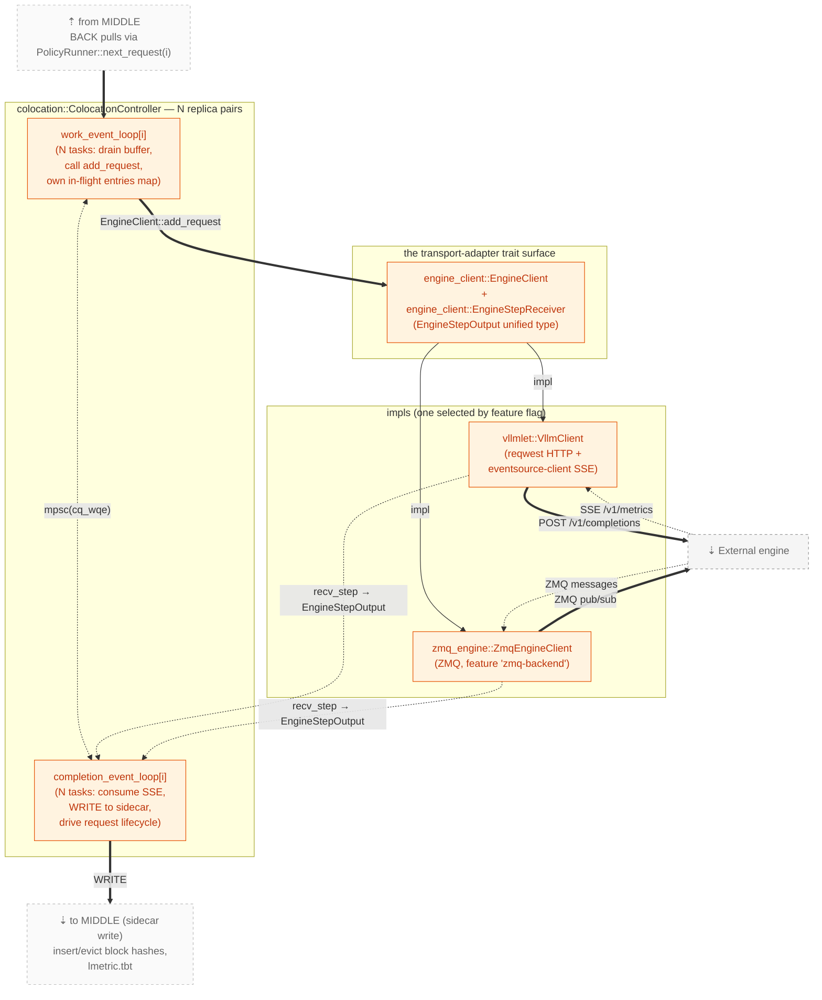

# BACK layer — Engine driver

> Back to [`README.md`](README.md). See also: [`request-lifecycle.md`](request-lifecycle.md) for the request flow that hits this layer, [`middle-scheduler.md`](middle-scheduler.md) for the upstream MIDDLE that hands work to BACK.

**Responsibility**: **execute** the scheduler's decisions. Pull the
already-routed `Entry` from `PolicyRunner`'s per-replica buffer, drive
it through the engine via `EngineClient::add_request`, consume the
engine's SSE step stream, own the in-flight request lifecycle, and
**write the observed engine state back to the `ScheduleContext`
sidecar** in MIDDLE.

BACK has no policy logic. It does not pick replicas — by the time
an `Entry` reaches a `work_event_loop[i]`, MIDDLE has already
committed it to replica `i`. BACK's only freedom is the engine
transport (HTTP+SSE today, ZMQ alternative).

## Modules

| Module (current path)  | Role                                                                          | LOC  |
|------------------------|-------------------------------------------------------------------------------|------|
| `colocation.rs`        | `ColocationController` + the two per-replica async loops: `work_event_loop` (drains the commit buffer via `next_request(i)`, calls `EngineClient::add_request`, owns the in-flight `entries` map) and `completion_event_loop` (consumes engine SSE → `EngineStepOutput`, writes to the `ScheduleContext` sidecar, drives request lifecycle bookkeeping) | 1105 |
| `engine_client.rs`     | The `EngineClient` + `EngineStepReceiver` traits + the unified `EngineStepOutput` type. The single point of dispatch from `colocation` to a transport adapter | 518  |
| `vllmlet.rs`           | `VllmClient` — reqwest-based HTTP client to a single engine; `/v1/metrics` SSE consumer that yields `VllmMetric` | 309  |
| `zmq_engine.rs`        | Alternate ZMQ transport (feature-gated `zmq-backend`)                          | 595  |

## Back-internal containment + wiring



## The engine-adapter trait surface

The trait surface is small enough to quote in full:

```rust
// engine_client.rs
pub trait EngineClient: Send {
    async fn add_request(&mut self, req: ValidGenerateRequest) -> Result<(), EngineClientError>;
    async fn abort_request(&mut self, id: u64) -> Result<(), EngineClientError>;
    fn get_error_rx(&mut self) -> mpsc::UnboundedReceiver<u64>;
    fn take_step_receiver(&mut self) -> Box<dyn EngineStepReceiver>;
}

pub trait EngineStepReceiver: Send {
    async fn recv_step(&mut self) -> Result<EngineStepOutput, EngineClientError>;
}
```

Adding a new engine transport = `impl`-ing this trait. Neither MIDDLE
nor `colocation` change.
