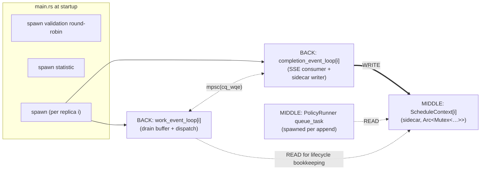

# Concurrency model

> Back to [`README.md`](README.md). Cross-reference: the [request lifecycle](request-lifecycle.md) explains *what* the tasks do; this file enumerates *which* tasks exist, *what* channels/locks connect them, and *which invariants* hold.

## Tasks per replica (n = number of engines)

## Channels and locks

| Object | Type | Producers | Consumers |
|---|---|---|---|
| `Entry`'s `response_tx` | `mpsc::UnboundedSender<Result<InferStreamResponse, _>>` | BACK's per-replica work loops, completion loop | `Infer::generate` (per request) |
| `cq_wqe` (per replica) | `mpsc::Receiver<Entry>` | BACK's `work_event_loop` | BACK's `completion_event_loop` |
| `cq_error` (per replica) | `mpsc::UnboundedReceiver<u64>` | `EngineClient::get_error_rx()` | BACK's `completion_event_loop` |
| `all_commit_req_buffers[i]` | `VecDeque<(u64, Entry)>` (NO mutex — owned exclusively by `PolicyRunner::queue_task`) | filled by the `Append` branch of `queue_task` (MIDDLE) | drained by the `NextRequest` branch of `queue_task`, called from BACK's `work_event_loop[i]` (BACK→MIDDLE pull) |
| `ScheduleContext[i]` *(data-sidecar)* | `Arc<Mutex<…>>` | BACK's `completion_event_loop` (sole writer) | MIDDLE's `PolicyRunner` (read in `Policy::schedule`); BACK's `work_event_loop` (read for lifecycle bookkeeping) |
| `simulator`'s private state *(service-sidecar internals, feature `simulator`)* | `Vec<Arc<PCtx>>` per `SimulatorRuntime` (one global `OnceLock`); each `PCtx` carries its own internal `Mutex<…>` per layer (L1 mirror, L2 regressor, L3 ephemeral). **Not** Arc-shared with consumers. | MIDDLE's `simulator` module (sole writer, off `on_admit`/`on_sse` silent wiring) | accessed only via `simulator::query(replica, …)` from simulator-aware policies — never directly |
| `RadixTreeBlockHash::mtx` | internal `SpinLock` | inside `radixtree::block_hash` only | inside the same |
| `Semaphore` | `Arc<tokio::sync::Semaphore>` | every accepted request decrements | every finished request increments |

## Invariants

- **`completion_event_loop` is the only writer to a replica's
  `ScheduleContext`.** This is what makes the sidecar pattern safe
  with a single `Mutex` — no reader/writer split needed because
  there is exactly one writer in the system.
- **One `Entry` lives in exactly one place at a time.** It is produced
  by `Validation` (FRONT), owned by `PolicyRunner`'s commit buffer
  (MIDDLE) until BACK pulls it, then by the work loop's `entries`
  map (BACK), then dropped after the engine reports finish. Lifetime
  tracking is via `request_id` in debug asserts.
