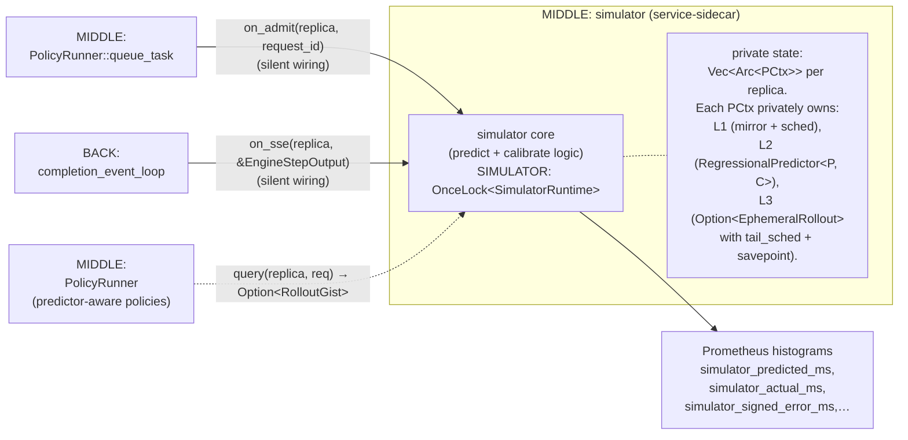

# Latency simulator (service-sidecar)

> Back to [`README.md`](README.md). This file describes the simulator's
> **system-level role** — how it fits into the MIDDLE layer as a
> service-sidecar to `PolicyRunner`. For the predictor's internal
> design (the L1 / L2 / L3 layer model, the savepoint mechanics, the
> drop semantics, etc.) see [`../predictor/`](../predictor/) — that
> directory is the source of truth for the simulator subsystem.

## Role at a glance

When built with `--features simulator,<policy>` (where `<policy>` is a
prediction-based policy such as `least-ttft-q`) AND launched with
`--enable-simulator`, the simulator is a MIDDLE subsystem that acts as
a **service-sidecar** to `PolicyRunner`:

- Its private state is **silently fed** by `on_admit` (from MIDDLE) and
  `on_sse` (from BACK).
- Predictor-aware policies retrieve predictions by calling `query()`.
- Without `--enable-simulator`, the subsystem is dormant and policies
  that try to call `query()` get back `None` (the contract is
  best-effort: never refuse to return).

The simulator is a **service-sidecar** (not a data-sidecar): its
internal state is private and the consumer-facing surface is `query()`,
not `Arc<Mutex<PCtx>>`. See [`README.md`](README.md) §2.3 for the
sidecar pattern and the data-sidecar/service-sidecar distinction.

## Public API surface

What `simulator::*` actually exposes:

| Function | Role |
|---|---|
| `init_with_predictor(num_replicas, config, inner)` | Builder; install a custom predictor (used in tests + alt regressors). Wraps `inner` in `RegressionalPredictor::new(inner, LinregCorrector::new(config))`. |
| `init_vidur_rf(num_replicas, config)` | Production initialiser; instantiates the Vidur random-forest regressor. |
| `is_active() -> bool` | Cheap check used by call sites to skip the `query()` path when the feature is off or `--enable-simulator` was not passed. |
| `on_admit(replica_index, entry)` | **Silent wiring entry point.** Called from `policies::PolicyRunner::queue_task` when an `Entry` is admitted to replica `i`. Updates the L1 mirror + per-request progress; runs the L3 promote-or-drop branch (clearing the savepoint on promote since the whole buffer becomes baseline). |
| `on_sse(replica_index, m)` | **Silent wiring entry point.** Called from `back::completion_event_loop` on every engine SSE event (positioned **after** the SCtx prefix-cache write — see "Cross-sidecar ordering" below). Drives L2 calibration, syncs `sched`, runs `mirror.apply_sse`, advances the anchor, runs L3 4-branch maintenance (Branch 1 F3-PASS pops slot[0] and decrements savepoint; F3-FAIL or stale-anchor drops). |
| `query(replica_index, candidate_id, input_length, candidate_hashes, sctx_prefix_hits) -> Option<RolloutGist>` | **Service API.** Predicts the latency of admitting `candidate_id` on replica `i`. Three-way recovery: clean baseline → extend in place; stale candidate-bound with savepoint → truncate and extend; otherwise → scratch rebuild. |

Consumers as of 2026-05-10: `least-ttft-q` (the first
prediction-based policy; picks the replica with the minimum
`RolloutGist.ttft_ms`). See
[`../predictor/least-ttft-q-test-results.md`](../predictor/least-ttft-q-test-results.md)
for its first end-to-end run.

## Comparison with the data-sidecar

The simulator's internal `RadixTreeReqIdHash` (inside its L1 mirror)
and the `ScheduleContext.block_hash` (data-sidecar in MIDDLE, written
by BACK) are both radix tries at the data-structure level, but they:

- Are **written by different subsystems**: `ScheduleContext` by BACK
  off live SSE; the simulator's prefix mirror by the simulator's
  silent-wiring callbacks.
- Track **different things**: `ScheduleContext.block_hash` tracks
  *what the engine actually has* (V = `Bids`, multi-bid concurrent);
  the simulator's prefix mirror tracks *what the simulator believes
  about in-flight requests* (V = `ReqId`, per-request).
- Have **different access shapes**: `ScheduleContext` is read
  directly by policies via `Arc<Mutex>` (data-sidecar); the
  simulator's mirror is private — only `query()` is reachable
  (service-sidecar).

The two specializations live in the `radixtree` crate because both
need the same Patricia-trie infrastructure but with non-overlapping
requirements.

## Cross-sidecar ordering (in `colocation.rs`)

Per engine SSE step, the completion event loop:

1. Acquires the `ScheduleContext` lock.
2. Writes `m.new_block_hashes_ids` into `sctx.block_hash`.
3. Drops the `ScheduleContext` lock.
4. **Then** calls `simulator::on_sse(replica_index, &m)`.

This ordering closes a TOCTOU window where a concurrent `query()`
could otherwise see post-step `mirror` state but pre-step
`SCtx.block_hash`, underestimating prefix hits in the
`request-finishes-with-new-blocks-in-same-step` case. Detail in
[`../predictor/three-layer-architecture.md`](../predictor/three-layer-architecture.md) §1.2.

## Where the design lives

- [`../predictor/README.md`](../predictor/README.md) — predictor doc index.
- [`../predictor/three-layer-architecture.md`](../predictor/three-layer-architecture.md) — structural design (L1 / L2 / L3, savepoint, naming rationale).
- [`../predictor/behavior.md`](../predictor/behavior.md) — behavioral description (3 APIs, exact state transitions per call, mermaid diagrams, worked example).
- [`../predictor/least-ttft-q-test-results.md`](../predictor/least-ttft-q-test-results.md) — first end-to-end run on Qwen2.5-7B × 8.
