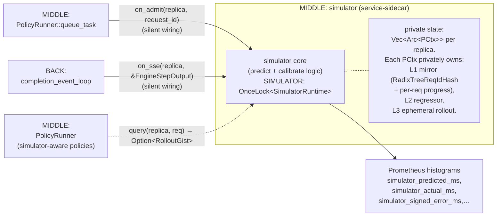

# Latency simulator (service-sidecar)

> Back to [`README.md`](README.md). The simulator is the canonical example of a **service-sidecar** in this system — read [`README.md`](README.md) §2.3 for the pattern; this file describes the simulator specifically.

## When it activates

When built with `--features simulator,<name>-q` AND launched with
`--enable-simulator`, the simulator (a MIDDLE subsystem) acts as a
**service-sidecar** to `PolicyRunner`: its private state is silently
fed by `on_admit` (from MIDDLE) and `on_sse` (from BACK), and
simulator-aware policies retrieve predictions by calling `query()`.

Read this picture as: **the simulator is a service-sidecar to
PolicyRunner.** Its silent wiring (`on_admit` from MIDDLE, `on_sse`
from BACK) keeps its private state (`Vec<Arc<PCtx>>`, each `PCtx`
holding the L1 mirror + L2 regressor + L3 ephemeral) fresh in the
background; consumers (the future `simulator-q` policy and any other
simulator-aware policy) call `query(replica, request_id, …)` and get
an `Option<RolloutGist>` back without ever touching the internal types.

`Vec<Arc<PCtx>>` and the per-replica `PCtx` internals are private
fields of `simulator` — they are NOT shared via `Arc<Mutex<…>>` with
any consumer, by design (see [`README.md`](README.md) §2.3 on the
service-sidecar flavor).

## Public API surface

What `simulator::*` actually exposes:

| Function | Role |
|---|---|
| `init_with_predictor(num_replicas, config, inner)` | Builder; install a custom predictor (used in tests + alt regressors). |
| `init_vidur_rf(num_replicas, config)` | Production initialiser; instantiates the Vidur random-forest regressor. |
| `is_active() -> bool` | Cheap check used by call sites to skip the `query()` path when feature is off or `--enable-simulator` was not passed. |
| `on_admit(replica_index, entry)` | **Silent wiring entry point.** Called from `policies::PolicyRunner::queue_task` when an `Entry` is admitted to replica `i`. Updates the L1 mirror and per-request progress. |
| `on_sse(replica_index, m)` | **Silent wiring entry point.** Called from `back::completion_event_loop` on every engine SSE event. Maintains the predictor's invariants (anchor step ID, regressor calibration, ephemeral rollout discard). |
| `query(replica_index, candidate_id, input_length, candidate_hashes, sctx_prefix_hits) -> Option<RolloutGist>` | **Service API.** Predicts the latency of admitting `candidate_id` on replica `i`, conditioned on the live snapshot of the predictor's state. Currently defined but **not consumed** by any production policy — exists for the future `simulator-q` policy. |

## Comparison with the data-sidecar

The simulator's internal `RadixTreeReqIdHash` (inside its L1 mirror)
and the `ScheduleContext.block_hash` (data-sidecar in MIDDLE, written
by BACK) are both radix tries at the data-structure level, but they:

- Are **written by different subsystems**: `ScheduleContext` by BACK
  off live SSE; the simulator's prefix mirror by the simulator's
  silent-wiring callbacks.
- Track **different things**: `ScheduleContext.block_hash` tracks
  *what the engine actually has* (V = `Bids`, multi-bid concurrent);
  the simulator's prefix mirror tracks *what the simulator believes
  about in-flight requests* (V = `ReqId`, per-request).
- Have **different access shapes**: `ScheduleContext` is read
  directly by policies via `Arc<Mutex>` (data-sidecar); the
  simulator's mirror is private — only `query()` is reachable
  (service-sidecar).

The two specializations live in the `radixtree` crate because both
need the same Patricia-trie infrastructure but with non-overlapping
requirements.

Design rationale for the three-layer `PCtx`, the calibration loop,
and the future `simulator-q` policy is in
[`../../.claude/memory/project_lmetric_predictor_design.md`](../../.claude/memory/project_lmetric_predictor_design.md).
