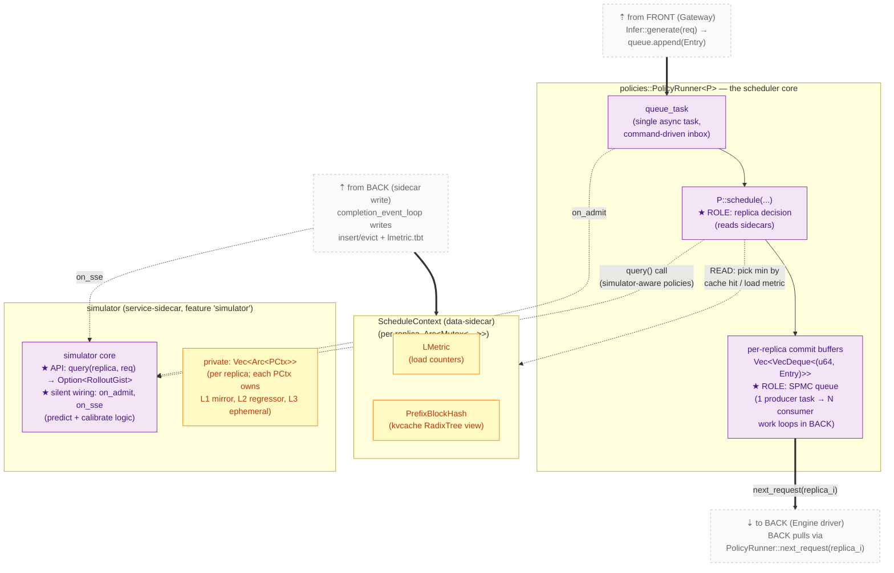

# MIDDLE layer — Scheduler

> Back to [`README.md`](README.md). Read [`README.md`](README.md) §2.3 first if you haven't seen the **Sidecar pattern** introduction — it's the central concept this layer is organised around.

**Responsibility**: **decide** which replica runs each request and
maintain the SPMC commit buffer that BACK pulls work from. Read
sidecar state — `ScheduleContext` directly, `simulator::query()` for
simulator-aware policies — to inform decisions. Optionally host the
`simulator` service-sidecar (which owns its predictor state privately
and is silently fed by `on_admit`/`on_sse`).

MIDDLE does not run engines, does not poll SSE, does not own the
request lifecycle past the moment the `Entry` is committed to a
replica's buffer. All of that lives in [BACK](back-engine-driver.md).

## Modules

| Module (current path) | Role                                                                          | LOC  |
|-----------------------|-------------------------------------------------------------------------------|------|
| `infer.rs`            | `Infer` — process orchestrator. Owns validation, queue, the concurrency `Semaphore`, and `PolicyRunner`. **Spawns BACK's `ColocationController`** at startup. Public method `generate(req)` is the gateway-facing handle. | 530  |
| `queue.rs`            | 8-line shim — re-exports `Entry`, `QueuePro`, `TaskAssigner` from `policies/`. Queue logic itself lives in `policies/policy_runner.rs`. | 8    |
| `policies/`           | DSL-driven scheduling policies (18 of them, one per upstream baseline). One Cargo feature flag selects the active policy at compile time. **This is the actual scheduler.** | dir  |
| `metrics.rs`          | Defines the `ScheduleContext` data-sidecar struct (`LMetric` + `PrefixBlockHash`). Tunable constants for policies (`BAILIAN_*`, `MOST_HIT_LOAD_*`, …). **Note**: this `metrics.rs` is unrelated to the Prometheus crate also called `metrics` (which `server.rs` imports as `metrics = "0.21.1"` and uses for `metrics::increment_counter!`). The naming collision is real and is the reason [`../refactor-plan.md`](../refactor-plan.md) renames the file to `scheduler/state.rs`. | 216  |
| `kvcache.rs`          | `BlockHashState` (per-request prefix-hash builder used by BACK to compute hashes for insertion), `mod hashtable_block_hash` (alternative `BlockHash` impl selected by the `hashtable-blockhash` feature), the feature-gated `PrefixBlockHash` re-export from the `radixtree` crate. | 1130 |
| `statistic.rs`        | Statistics task spawned by `Infer` to dump `ScheduleContext` periodically     | 47   |
| `simulator/`          | Latency simulator (feature `simulator`). **Service-sidecar to `PolicyRunner`**: subscribes silently to BACK's `on_sse` and `PolicyRunner`'s `on_admit` (the silent wiring); owns `Vec<Arc<PCtx>>` (one `PCtx` per replica) as **private state**, where each `PCtx` privately owns the L1 mirror (`RadixTreeReqIdHash` + per-request progress), L2 regressor, and L3 ephemeral rollout; exposes `query(replica, request_id, …) -> Option<RolloutGist>` to simulator-aware policies (none consume it yet — purely future). | dir  |

## Scheduler-internal containment + wiring



## How to read PolicyRunner's three roles off this picture

1. **It is an SPMC queue.** Read it as: one `queue_task` producer
   feeds `pr_buf`, which fans out to N consumer work loops in BACK
   via `next_request(replica_i)`. The `pr_buf` node carries the
   `★ ROLE: SPMC queue` annotation precisely so this fan-out is
   readable.
2. **It does not own its input — sidecars do.** PolicyRunner reads
   `ScheduleContext` (data-sidecar) via dashed `READ` arrow and calls
   the `simulator` (service-sidecar) via `query()` for
   simulator-aware policies; it does not write either. The sidecars
   are Arc-shared per-replica state (`ScheduleContext`) or an
   encapsulated subsystem (`simulator`); whoever writes/feeds them
   (BACK for `ScheduleContext`, the silent `on_admit`/`on_sse`
   wiring for the simulator) is upstream of the scheduler, not part
   of it.
3. **It is wired to engine SSE — through the schedule sidecar.** Trace
   the SSE chain: external engine → BACK's `recv_step` → BACK's
   `completion_event_loop` → WRITE into `ScheduleContext` → READ by
   `pr_dec` on the next decision. PolicyRunner does not subscribe to
   SSE itself; it sees the engine's effects by reading state that
   BACK is the SOLE writer of (see [`concurrency-model.md`](concurrency-model.md) for the invariant).

## Two scheduler-internal invariants

- **`completion_event_loop` is the only writer to `ScheduleContext`** —
  see [`concurrency-model.md`](concurrency-model.md). PolicyRunner is
  a pure reader of it.
- **Policies are picked at compile time.** Exactly one `<name>-q`
  Cargo feature is enabled per build → exactly one
  `TaskAssigner = PolicyRunner<XQ>` alias is monomorphised into the
  binary. There is no runtime policy switching.

## The `Policy` abstraction

Every policy implements one trait:

```rust
// Currently at: router/src/policies/policy_trait.rs
pub trait Policy {
    type GlobalContext: Default + Send + Sync + 'static;

    fn schedule<'a>(
        entry: &'a Entry,
        all_sctx: &'a [Arc<Mutex<ScheduleContext>>],
        gctx: &'a mut Self::GlobalContext,
    ) -> impl Future<Output = Option<usize>> + Send + 'a;
}
```

Note the signature: `schedule` reads `&[Arc<Mutex<ScheduleContext>>]`
(one per replica). The data-sidecar relationship is hard-baked into
the trait — `PolicyRunner` hands every policy the sidecar slice and
the policy's job is to read it and pick one index. (A future
simulator-aware variant of the trait will additionally take a handle
to the `simulator` service-sidecar — e.g., an `Arc<Simulator>`
exposing `query(replica, req) -> Option<RolloutGist>` — instead of
any internal predictor state.)

You don't write this `impl` by hand. You write a DSL spec and the
`policy! { … }` proc macro from `policy-dsl/` lowers it. Example
(`router/src/policies/lmetric.rs`):

```text
policy lmetric-q (gctx: ()):
    Select min by sctx.prefill_tokens(req) · (sctx.bs + 1)
    after: default
```

The spec form is documented in [`../dsl/policies.md`](../dsl/policies.md) §2.
The lowering table (DSL → Rust) is in [`../dsl/implementation.md`](../dsl/implementation.md) §2.1.

`PolicyRunner<P: Policy>` (`policy_runner.rs`) is the generic shim that:
1. Owns the per-replica commit buffers (lossless admission).
2. Spawns one `queue_task` per `append()` call.
3. Calls `P::schedule(...)` (which reads sidecars) and pushes the
   entry into the chosen replica's buffer.
4. Serves `next_request(replica_i)` to BACK so it can drain.

## Why this is a Sidecar pattern, not "PolicyRunner has fields"

The alternative we chose **against**: `PolicyRunner<P>` could have
`Vec<ScheduleContext>` directly as a field. We deliberately don't:

- `PolicyRunner` is generic over `P: Policy`. Different `P`s want
  different sidecar combinations. `lmetric-q` only needs
  `ScheduleContext` (data-sidecar); the future `simulator-q` will
  also need a handle to the `simulator` service-sidecar; a
  hypothetical pure-RR policy needs neither. Embedding sidecar
  fields would push that conditioning into the generic.
- The writers (`completion_event_loop` for `ScheduleContext`; the
  silent `on_admit`/`on_sse` callbacks for the `simulator`) are not
  parts of `PolicyRunner` — they are independent subsystems on
  independent schedules. Sharing via `Arc<Mutex<…>>` (data-sidecar)
  or `Arc<Simulator>` (service-sidecar) is the lowest-coupling way
  to wire them.
- Sidecars are added/dropped by feature flag. `--features simulator`
  causes the `simulator` service-sidecar to come into existence.
  Without that feature, the type isn't even compiled. Embedded
  fields would force cfg guards through `PolicyRunner`'s struct.

The `Arc<…>` per consumer is the entire wiring contract — `Arc<Mutex<T>>`
for a data-sidecar, `Arc<Service>` for a service-sidecar. Adding a
new data-sidecar = adding a new `Vec<Arc<Mutex<NewCtx>>>`, registering
a writer, and giving the policy `&[Arc<Mutex<NewCtx>>]` to read.
Adding a new service-sidecar = building a subsystem that owns its
private state, registering its silent-wiring callbacks, and giving
the policy a handle to its service trait.
