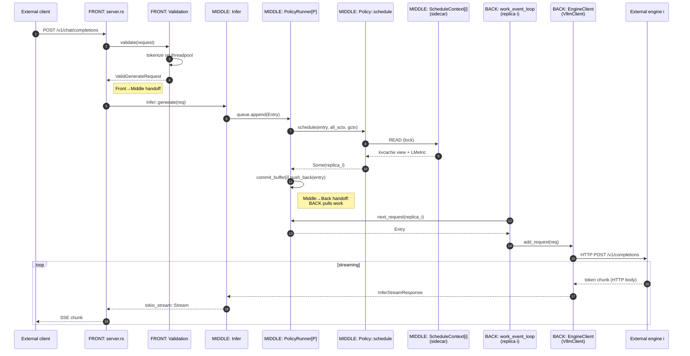

# Request lifecycle (across layers)

> Back to [`README.md`](README.md). This file traces what happens to a single `POST /v1/chat/completions` end-to-end. For per-layer details see [`front-gateway.md`](front-gateway.md), [`middle-scheduler.md`](middle-scheduler.md), [`back-engine-driver.md`](back-engine-driver.md). For the related but parallel SSE consumption path, see §"Engine SSE consumption" below.

## End-to-end happy path

`POST /v1/chat/completions` to streamed response. The colours match the
layer palette in [`README.md`](README.md) §2.4.



## Engine SSE consumption (the second half)

In parallel with the request path above, every replica has a **second**
async task in BACK pulling SSE events from the engine and writing the
observed state back into MIDDLE's `ScheduleContext` sidecar:

```mermaid
sequenceDiagram
    autonumber
    participant En as External engine i
    participant Vc as BACK: VllmClient<br/>(SSE consumer)
    participant Cl as BACK: completion_event_loop<br/>(replica i)
    participant Sx as MIDDLE: ScheduleContext[i]<br/>(sidecar, Arc&lt;Mutex&lt;…&gt;&gt;)

    loop forever
        En-->>Vc: SSE event /v1/metrics<br/>(VllmMetric)
        Vc-->>Cl: EngineStepOutput
        Cl->>Sx: lock + apply (insert/evict block hashes,<br/>update lmetric.tbt, …)
        Sx-->>Cl: ok
        Cl-->>Cl: per-request lifecycle bookkeeping
    end
```

Why this matters:

- The router's view of "what's in each replica's KV cache" — the
  `radixtree::RadixTreeBlockHash` inside `ScheduleContext.block_hash` —
  is updated **only** here. Scheduling policies in MIDDLE read this
  state when picking a replica, but MIDDLE itself never writes it.
- The **completion loop is the SOLE writer** to
  `ScheduleContext.block_hash`. The work loop and the policy hot
  path are readers (under the same `Mutex`). This sole-writer
  invariant is what makes the sidecar pattern safe with a single
  `Mutex` — no reader/writer split needed because there is exactly
  one writer in the system. See [`concurrency-model.md`](concurrency-model.md)
  for the full invariant table.
- The completion loop also drives the simulator's silent-wiring hook
  (`simulator::on_sse`) when feature `simulator` is enabled — that
  is how the simulator service-sidecar's private state is kept fresh.
  See [`latency-simulator.md`](latency-simulator.md).
