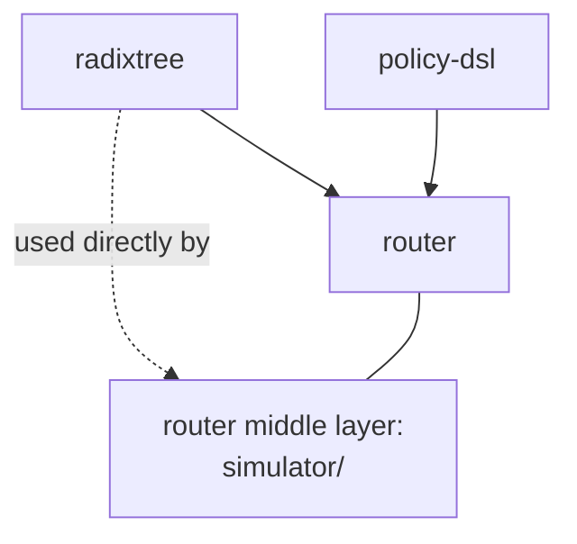

# Workspace layout & Cargo features

> Back to [`README.md`](README.md).

## Workspace members

`blitz-router` is a Cargo workspace with four members:

| Member         | Role                                                          | Loaded by         |
|----------------|---------------------------------------------------------------|-------------------|
| `router/`      | The router itself: all three layers ([FRONT](front-gateway.md), [MIDDLE](middle-scheduler.md), [BACK](back-engine-driver.md)). Internal data types (`Tokens`, `GeneratedText`, `FinishReason`, `InfoResponse`, `NextTokenChooserParameters`, `StoppingCriteriaParameters`, `Generation`) live in `router/src/types.rs`. | top-level binary  |
| `radixtree/`   | Patricia-trie crate (`BlockHash` trait + production impl + Verus L0 spec + L0..L3 lowering bench ladder). Provides the trie types used by both sidecars (`PrefixBlockHash` for the `ScheduleContext` data-sidecar, `RadixTreeReqIdHash` for the `simulator` service-sidecar's private prefix mirror). | `router/` middle (sidecar types) and back (`BlockHashState` builder) |
| `policy-dsl/`  | Proc macro `policy! { … }` that lowers a DSL spec into `impl Policy for X` | `router/` middle layer |
| `request-sim/` | Git submodule — Rust load generator. Lives in this workspace only because the Cargo workspace lets developers `cargo run -p request-sim` from one checkout | standalone binary |

## Cargo features as wiring switches

Several features rewire components at compile time. The complete list:

| Feature                     | Switches                                      | Layer |
|-----------------------------|-----------------------------------------------|-------|
| `radixtree-blockhash` *(default)* | `PrefixBlockHash = radixtree::RadixTreeBlockHash` (sidecar trie type) | middle |
| `hashtable-blockhash`       | `PrefixBlockHash = HashTableBlockHash`        | middle |
| `default-hash-algo` *(default)* | `BackendBlockHash = [u64; 1]`                | middle |
| `sha256-hash-algo`          | `BackendBlockHash = [u64; 4]`                 | middle |
| `vllm-backend` *(default)*  | enables `VllmClient` (HTTP+SSE)               | back   |
| `zmq-backend`               | enables `ZmqEngineClient`                     | back   |
| `<name>-q` (one of 18)      | selects `TaskAssigner = PolicyRunner<XQ>`     | middle |
| `simulator`                 | builds the `simulator/` subsystem (a service-sidecar to PolicyRunner with private `Vec<Arc<PCtx>>`); silent wiring (`on_admit`/`on_sse`) activates only if `--enable-simulator` is also passed at runtime | middle |
| `python-chat-template`      | enables PyO3-based chat template renderer     | front  |
| `ngrok` *(default)*         | exposes the server through ngrok              | front  |

Rule of thumb: anything in the table swaps a concrete impl behind a
trait or type alias. There are no runtime-config branches for these.

The `vllm-backend` / `zmq-backend` pair is enforced mutually-exclusive
by a top-level `compile_error!` in `lib.rs`. The 18 `<name>-q` features
are NOT enforced mutually exclusive in the Cargo manifest — the
build script and `lib.rs` rely on the `TaskAssigner` type alias being
defined exactly once, so enabling more than one `<name>-q` will produce
a duplicate-definition compile error.
