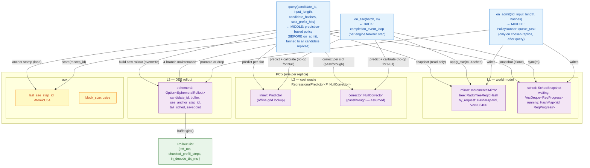
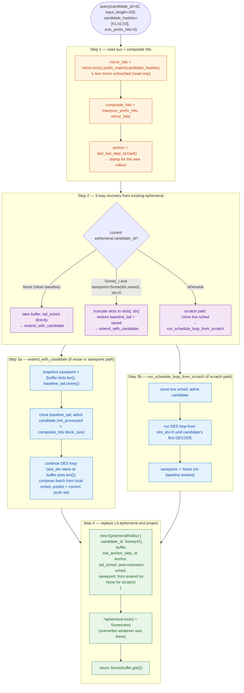
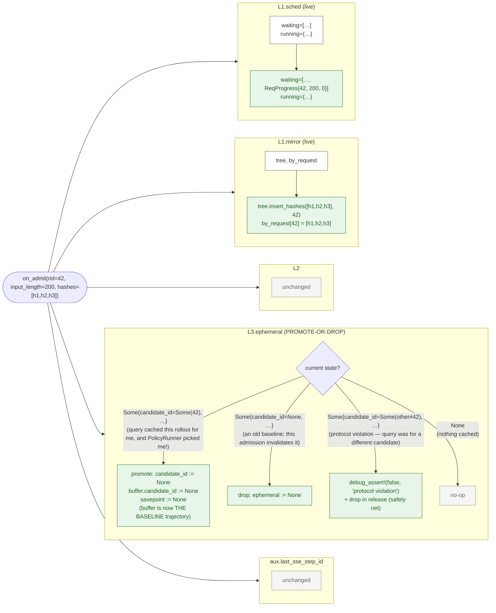
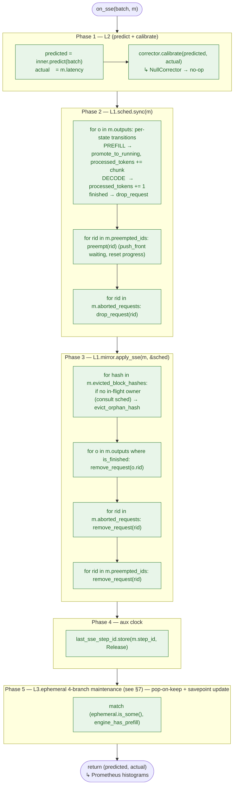
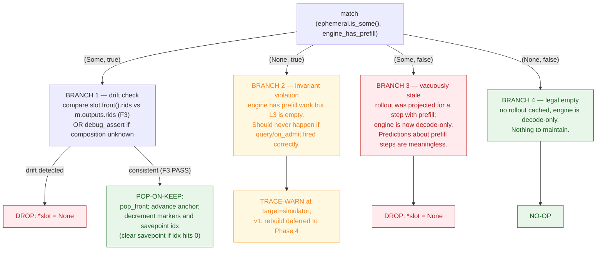

# Simulator behavior — three layers, three APIs, and how state moves

> Companion to:
> - [`three-layer-architecture.md`](three-layer-architecture.md) — the *structural* design (what each layer is and why it's shaped that way).
> - [`../architecture/latency-simulator.md`](../architecture/latency-simulator.md) — the *system-level* role (simulator as service-sidecar to PolicyRunner).
>
> This file is the *behavioral* description: what the three layers actually
> hold, **how PolicyRunner uses them**, and exactly how each of the three
> external APIs (`on_admit`, `on_sse`, `query`) mutates that state.

> **L2 naming pinned (2026-05-09).** Throughout this file:
>
> | Concept                                | Trait        | Concrete (in this doc) |
> |----------------------------------------|--------------|------------------------|
> | offline model: features → ms scalar    | `Predictor`  | `VidurRfPredictor` |
> | online correction strategy             | `Corrector`  | `NullCorrector` *(assumed for diagrams below)* |
> | wrapper combining both                 | `RegressionalPredictor<P, C>` | `RegressionalPredictor<VidurRfPredictor, NullCorrector>` |
>
> Sibling concrete `Corrector` impls: `LinregCorrector` (the affine
> `w0·raw + w1` SGD strategy used in production) and `NullCorrector`
> (passthrough). For this doc, **L2 =
> `RegressionalPredictor<P, NullCorrector>`** — the online correction is
> a no-op so the rollout traces stay deterministic.
>
> Naming rationale (echoed for the rest of this file):
> - `Corrector` over `Regressor` — the role is *adjusting one prediction
>   toward an observation*; calling the trait `Regressor` and its SGD
>   impl `LinregRegressor` reads as "regression regressor", which is
>   sleep-talk.
> - `RegressionalPredictor<P, C>` over `Calibrated` — adjective form
>   ("a predictor that has a regression on top of it") avoids the vague
>   past-participle while keeping the "regression" terminology as a
>   property, not a noun-noun compound.

## 1. Request lifecycle through the simulator (the timing!)

The relative order of `query`, `on_admit`, and `on_sse` is not "they
happen in some order"; it is a fixed three-phase dance per request,
driven by `PolicyRunner`. Most of the doc below leans on this — read
this section first.

```mermaid
sequenceDiagram
    autonumber
    participant FE as FRONT (gateway)
    participant Pol as MIDDLE: PolicyRunner
    participant SimAll as simulator (all replicas)
    participant SimOne as simulator (chosen replica)
    participant BE as BACK (engine driver)
    participant Eng as External engine

    FE->>Pol: Entry { request, hashes, … }
    Note over Pol: candidate is NOT yet in any replica's live sched

    loop for each replica i
        Pol->>SimAll: query(i, candidate, …) → RolloutGist
        Note over SimAll: clone(sched_i), admit candidate to CLONE,<br/>roll forward, return gist;<br/>live sched_i untouched
    end

    Note over Pol: rank gists, pick best replica i*

    Pol->>SimOne: on_admit(i*, candidate, …)
    Note over SimOne: live sched_{i*}.waiting.push_back(candidate)<br/>mirror_{i*}.insert_request(...)<br/>L3 promote-or-drop

    Pol->>BE: route Entry to replica i*
    BE->>Eng: POST /v1/completions

    loop per engine forward step
        Eng-->>BE: SSE event m
        BE->>SimAll: on_sse(i*, &m)
        Note over SimAll: L2 calibrate, sched.sync, mirror.apply_sse,<br/>anchor bump, L3 4-branch maintenance
    end
```

**Three load-bearing implications of this ordering:**

1. **`query` runs *before* `on_admit`.** Every gist returned to
   PolicyRunner is a hypothetical: "if I admitted this candidate to
   replica i, this is what I expect." The candidate is **not** in
   replica i's live `sched.waiting` yet — `query` admits it to a
   per-call **clone** of `sched`, runs the rollout there, and discards
   the clone (only `EphemeralRollout` is retained, see §5).
2. **`query` is fanned out to *all* (or many) replicas.** Each replica
   independently builds its own speculative `EphemeralRollout` for the
   same candidate. Only one of these will ever be promoted to baseline
   (by `on_admit` on the chosen replica); the rest become stale and
   are garbage-collected by the L3 4-branch maintenance on the next
   `on_sse` for those replicas.
3. **The chosen replica's `on_admit` is the only commit point.** Live
   `sched.waiting`, live `mirror.tree`, and a possible L3 promote-to-
   baseline only happen on the one chosen replica. Non-chosen replicas'
   live state never sees the candidate; their `EphemeralRollout` is
   left dangling until `on_sse` cleans it up.

## 2. The whole picture (structural)



## 3. Layer state — exact shapes

```rust
//————————————————————————————————————————————————————————————————
// L1 — world model
//————————————————————————————————————————————————————————————————

pub struct IncrementalMirror {
    tree: RadixTreeReqIdHash,                  // V = ReqId, per-block hash key
    by_request: HashMap<u64, Vec<u64>>,         // rid → admit-time hash sequence (clean removal)
}

pub struct SchedSnapshot {
    waiting: VecDeque<ReqProgress>,             // FCFS admission queue
    running: HashMap<u64, ReqProgress>,         // rid → in-flight progress
}

pub struct ReqProgress {
    request_id: u64,
    input_length: u32,
    processed_tokens: u32,                      // 0..input_length while PREFILL; ≥input_length once DECODE
}

//————————————————————————————————————————————————————————————————
// L2 — cost oracle (with NullCorrector assumed for this doc)
//————————————————————————————————————————————————————————————————

pub trait Predictor: Send + Sync {
    fn predict(&self, batch: &BatchForPredictor) -> f32;
}

pub trait Corrector: Send + Sync {
    fn correct(&self, raw_ms: f32) -> f32;
    fn calibrate(&mut self, raw_ms: f32, actual_ms: f32);
}

pub struct RegressionalPredictor<P: Predictor, C: Corrector> {
    inner:     Arc<P>,
    corrector: C,
}

pub struct NullCorrector;
impl Corrector for NullCorrector {
    fn correct(&self, raw_ms: f32) -> f32 { raw_ms }      // passthrough
    fn calibrate(&mut self, _raw: f32, _actual: f32) {}    // no-op
}

//————————————————————————————————————————————————————————————————
// L3 — DES rollout
//————————————————————————————————————————————————————————————————

struct EphemeralRollout {
    candidate_id:        Option<u64>,           // Some(rid)=candidate-bound; None=baseline (post-promotion)
    buffer:              RolloutBuffer,
    sse_anchor_step_id:  u64,                   // engine step at construction (advanced by on_sse pop-on-keep)
    tail_sched:          SchedSnapshot,         // sched state at the END of buffer (used by next query's extend)
    savepoint:           Option<(usize, SchedSnapshot)>,  // (split_idx, baseline_tail) — see §4 / §7
}

pub struct RolloutBuffer {
    pub candidate_id:        Option<u64>,
    pub slots:               VecDeque<RolloutSlot>,  // one slot ↔ one engine forward step
    pub prefill_begin_step:  Option<usize>,
    pub prefill_end_step:    Option<usize>,
    pub in_decode_step:      Option<usize>,
}

pub struct RolloutSlot {
    pub batch:             BatchForPredictor,
    pub predicted_lat_ms:  f32,
    pub prefill_rids:      SmallVec<[u64; 2]>,  // for F3 cross-check
    pub decode_rids:       SmallVec<[u64; 4]>,  // for F3 cross-check
}

pub struct RolloutGist {
    pub ttft_ms:                Option<f32>,
    pub chunked_prefill_steps:  Option<usize>,
    pub in_decode_tbt_ms:       Option<f32>,
}
```

## 4. API #3 (called first per request) — `query(candidate_id, input_length, candidate_hashes, sctx_prefix_hits)`

Trigger source: a prediction-based scheduling policy. PolicyRunner calls
this for **all candidate replicas**, *before* it picks one. Returns
`Option<RolloutGist>`.

The query has **three recovery modes** based on what's in `ephemeral`:

| Cached `ephemeral`                                              | Recovery mode | Outcome |
|------------------------------------------------------------------|---------------|---------|
| `Some{cid: None, buffer, tail_sched, …}` — clean baseline         | **reuse**     | extend baseline buffer in place with new candidate's tail |
| `Some{cid: Some(_), savepoint: Some((idx, baseline_tail)), …}` if `idx > 0` | **savepoint recovery** | truncate `slots[..idx]`, restore `baseline_tail`, then extend |
| `None`, or any other state | **scratch rebuild** | clone live `sched`, admit candidate, run DES from scratch |



**State change matrix:**

| Layer              | Touched? | Operation                                  |
|--------------------|----------|---------------------------------------------|
| L1.sched (live)    | read     | scratch path: `clone()` to a per-call mutable copy; reuse/savepoint path: not touched (cloned `tail_sched` is the sim basis) |
| L1.mirror (live)   | read     | `prefix_match(candidate_hashes)`; `tree` epoch unchanged |
| L2.inner           | read     | `predict(batch)` once per slot |
| L2.corrector       | read (no-op for `NullCorrector`) | `correct(raw_ms)` once per slot |
| L3.ephemeral       | **write**| 3-way `take()` then `*lock() = Some(new)` (overwrites) |
| aux.last_sse_step_id | read   | `load()` to stamp the new rollout's anchor |
| aux.block_size     | read     | unit conversion in the seed step |

**Key invariant: `query` does NOT touch live `sched.waiting`.** The
candidate is admitted to either a clone of live sched (scratch path)
or a clone of saved `tail_sched` / `baseline_tail` (reuse / savepoint
path). The clone is dropped after the loop. The only persistent
side-effect of `query` on PCtx is the L3 ephemeral overwrite.

**Stop condition** (locked as A3): candidate completes its prefill,
plus one in-decode slot is appended. Hard cap at 256 slots **applies to
total slots (baseline + extension)**.

**`gist()` projection from the buffer:**

| `RolloutGist` field          | source                                               |
|-------------------------------|------------------------------------------------------|
| `ttft_ms`                     | sum of `predicted_lat_ms` over slots `[0 .. prefill_end_step]` |
| `chunked_prefill_steps`       | `prefill_end_step − prefill_begin_step + 1`         |
| `in_decode_tbt_ms`            | the trailing in-decode slot's `predicted_lat_ms`     |

If the rollout terminated before reaching DECODE (defensive 256-cap
hit), all three fields are `None` and the caller treats the score as
unavailable.

## 5. API #1 (called second, on chosen replica only) — `on_admit(rid, input_length, hashes)`

Trigger source: `policy_runner.rs` immediately after
`all_commit_req_buffers[i*].push_back(...)` for the chosen replica `i*`
(see `simulator/mod.rs:131`).



**Step-by-step (lock order: `sched → mirror → ephemeral`):**

| # | Action                                                      | State change |
|---|-------------------------------------------------------------|--------------|
| 1 | `sched.lock().admit(ReqProgress::new(42, 200))`             | live `waiting.push_back({42, 200, 0})` |
| 2 | `mirror.lock().insert_request(42, [h1, h2, h3])`            | live `tree` gains hashes; `by_request[42] = [h1,h2,h3]` |
| 3 | `ephemeral.lock()` → 4-arm match (see diagram)               | promote / drop-baseline / debug_assert / no-op |

L2 is **never touched** by `on_admit`. Aux clock is **never touched**.

**Why the promote case matters.** If the same candidate that PolicyRunner
just `query`'d this replica for is the one being admitted, the cached
`EphemeralRollout` is no longer "speculative for candidate 42" — it is
the actual baseline trajectory of what the engine will do next. Promoting
it (clearing `candidate_id` AND clearing `savepoint`) makes the buffer
reusable as the baseline by the next `query` for a *new* candidate via
`extend_with_candidate`.

**For non-chosen replicas, `on_admit` is never called.** Their
`EphemeralRollout` (built speculatively during `query`) is dangling
until either (a) the next `on_sse` for those replicas detects drift via
F3 and drops it (Branch 1 FAIL or Branch 3), or (b) the next `query`
on that replica recovers the baseline portion via the savepoint (see
§4 recovery modes).

## 6. API #2 — `on_sse(batch, m)`

Trigger source: `colocation.rs` (`completion_event_loop`), called once
per engine forward step (`m: &EngineStepOutput`). The call site sits
**after** the SCtx prefix-cache update completes (post-2026-05-09 fix,
so `mirror` and `SCtx.block_hash` see consistent post-step views).



**Why this exact ordering** (load-bearing — see `pctx.rs::on_sse:438-491`):

1. **L2 first.** Captures `(predicted, actual)` against the batch *as
   the engine saw it* — before `sched` and `mirror` absorb the
   transitions. Calibration uses the input batch, not the post-step
   state. With `NullCorrector` this phase is a single read for
   `predicted` and a discard of `actual`; the wrapper still emits
   `(predicted, actual)` for the Prometheus histograms.
2. **`sched.sync(m)` before `mirror.apply_sse(m, &sched)`.** The
   eviction self-arbitration in `apply_sse` consults
   `sched.is_in_flight(rid)`: if `sched` were not yet synced,
   just-finished requests would still look in-flight, and the orphan-
   eviction path would wrongly preserve their hashes.
3. **`anchor.store` before L3 maintenance.** L3's stale-check compares
   `rollout.sse_anchor_step_id` to `last_sse_step_id.load()` — the
   bump must happen before the maintenance branch reads it.

## 7. The L3 4-branch maintenance — explained in detail

Inside `on_sse` Phase 5, L3 maintenance is a `match` on the **2×2
cross-product** of two booleans — *does L3 currently hold a rollout?*
and *does the engine have prefill work in this step?* The four cells
are the four branches.

```rust
// pctx.rs::on_sse, Phase 5 (paraphrased):
let engine_has_prefill = (m.prefill_tokens > 0)
                      || m.outputs.iter().any(|o| o.state == "PREFILL");
let mut slot = self.ephemeral.lock().…;
match (slot.as_mut(), engine_has_prefill) {
    (Some(e), true)  => { /* drift check; maybe drop */ }
    (None,    true)  => { /* trace-warn (invariant violation) */ }
    (Some(_), false) => { *slot = None;     /* drop unconditionally */ }
    (None,    false) => { /* no-op */ }
}
```



### 7.1 Branch 1 — `(Some, true)`: drift check; pop-on-keep

Engine has prefill work, and L3 holds some rollout. Two drift signals:

- **F3 composition cross-check** (preferred). If `slot.front().composition_known()`
  (i.e. `prefill_rids` and `decode_rids` are populated by the rollout
  loop), compare them as set-equality with the rids in `m.outputs`.
  Mismatch ⇒ drift. This catches the most important divergence: the
  rollout predicted a particular set of in-flight requests for the next
  step, and the engine's actual set differs.
- **Defensive `debug_assert!`** for the post-T8 invariant violation
  case where `slot.front().composition_known()` is false or `slots` is
  empty. Treats as drift in release.

If drift detected → `*slot = None` (drop).
If consistent → **pop-on-keep**:

- `e.buffer.slots.pop_front()` — consume the validated head slot.
- decrement `prefill_begin_step`, `prefill_end_step`, `in_decode_step`
  via `saturating_sub(1)`.
- `e.sse_anchor_step_id := m.step_id` — advance the anchor.
- decrement `e.savepoint`'s `split_idx` via `saturating_sub(1)`; if it
  hits zero, set `e.savepoint = None` (baseline portion fully consumed).

Pop-on-keep maintains the invariant **`slots.front()` is always the
next engine step relative to `sse_anchor_step_id`**. This is what makes
the buffer self-consistent under the `query → on_sse → on_admit`
interleaving (the on_sse advances the buffer in the middle, so by the
time on_admit promotes, the buffer's head is already the engine's true
next step).

### 7.2 Branch 2 — `(None, true)`: invariant violation

The simulator's invariant says: if the engine has prefill work in
progress, **L3 must be non-empty** (it should hold either a baseline
rollout or a candidate-bound rollout that covers this prefill activity).

If we end up here, the invariant is violated. Response: trace-warn
at `target=simulator` and defer rebuild to the next `query`.

When does this branch fire in practice?
- A candidate was `query`'d and admitted (rollout promoted to baseline);
  then the engine started serving it (prefill in progress); then a
  `query` for a *different* candidate fired and overwrote `ephemeral`;
  then `on_sse` fires. After the maintenance, the rollout for the new
  candidate is still there, so this branch shouldn't fire. Reach this
  branch typically requires a sequence where `ephemeral` was explicitly
  set to `None` (e.g. `on_admit` saw a baseline-drop case, or F3 dropped)
  right before an on-prefill `on_sse`. Rare; logged for diagnosis.

### 7.3 Branch 3 — `(Some, false)`: vacuously stale

L3 holds a rollout but the engine is decode-only. Whatever the rollout
predicted (it would have included at least one prefill slot for a
candidate, otherwise it wouldn't have been built) is no longer relevant
to what the engine is doing. Drop unconditionally.

### 7.4 Branch 4 — `(None, false)`: legal empty

No rollout, engine is decode-only. The legal "nothing to do" state.
No-op.

### 7.5 How non-chosen replicas get cleaned up (or recovered)

Every replica that PolicyRunner `query`'d but did NOT pick has an
`EphemeralRollout` in its L3 with `candidate_id = Some(cand)` for a
candidate that is never going to actually arrive on that replica. Two
paths to resolution:

1. **Cleanup via on_sse** (no further query before next SSE fires):
   - If the engine has prefill work (Branch 1), the F3 cross-check sees
     `slot.front().prefill_rids` containing `cand` but `m.outputs` does
     NOT contain `cand` — set-equality fails → drift → drop. ✓
   - If the engine is decode-only (Branch 3), drop unconditionally. ✓

2. **Recovery via savepoint** (a new query fires before drift is
   detected): the new `query` finds `ephemeral.candidate_id = Some(cand)`
   AND `ephemeral.savepoint = Some((idx, baseline_tail))`. It truncates
   `slots[..idx]`, restores `baseline_tail`, and extends with the new
   candidate. The baseline portion (everything that was projected
   *before* the dangling candidate's tail) is reused; only the new
   candidate's tail gets re-simulated.

Either way, the system self-resolves. Path 2 is strictly better when it
applies (avoids re-simulating the baseline), but path 1 is the safety
net that handles every other case.

## 8. Worked example — the actual ordering

Initial state: replica is empty.

```
PCtx state, t=0:
  L1.sched.waiting       = []
  L1.sched.running       = {}
  L1.mirror.tree         = ∅
  L1.mirror.by_request   = {}
  L2 (RegressionalPredictor<P, NullCorrector>) = (constant)
  L3.ephemeral           = None
  aux.last_sse_step_id   = 0
```

A new request arrives at PolicyRunner with `rid=42, input_length=200,
hashes=[h1, h2, h3]`. PolicyRunner has two replicas; we'll show the
chosen one (call it replica A). Assume `token_budget=128`,
`block_size=16`.

### t=1 — `query(candidate_id=42, …)` on replica A

Snapshot: `s = clone(sched_A)` → `s.waiting=[], s.running={}`.
`mirror_hits = mirror_A.prefix_match([h1,h2,h3]) = 0` (mirror is empty).
`composite = max(sctx_prefix_hits=0, 0) = 0` → `initial_processed = 0`.
`s.admit({42, 200, 0})` (on the **clone**, not live sched).
`anchor = last_sse_step_id.load() = 0`.

DES loop:
```
slot 0: pop {42,200,0} from s.waiting; chunk = min(200, 128) = 128
        → batch = {prefill: [42@128, computed=0], decode: []}
        predicted_lat_ms = inner.predict(batch); corrected = same (Null)
        s.running[42].processed_tokens = 128 (still prefilling)
slot 1: 42 still in running prefilling; chunk = min(200-128, 128) = 72
        → batch = {prefill: [42@72, computed=128], decode: []}
        s.running[42].processed_tokens = 200 (prefill complete)
        prefill_end_step = 1
slot 2: 42 in DECODE → batch = {prefill: [], decode: [42, computed=200]}
        in_decode_step = 2 → STOP
```

```
PCtx state, t=1 (after query on A):
  L1.sched (live)        = (UNCHANGED — scratch path cloned live sched, didn't touch original)
  L1.mirror (live)       = (UNCHANGED — read-only borrow)
  L2                     = (UNCHANGED — predict is read-only, calibrate not called)
  L3.ephemeral           = Some {
                             candidate_id: Some(42),
                             buffer: { slots: [s0, s1, s2],
                                       prefill_begin_step: Some(0),
                                       prefill_end_step:   Some(1),
                                       in_decode_step:     Some(2) },
                             sse_anchor_step_id: 0,
                             tail_sched: <post-DECODE-of-42 sched>,
                             savepoint: None  ← scratch path, no baseline existed
                           }
  aux.last_sse_step_id   = 0

returned: Some(RolloutGist {
  ttft_ms:               Some(s0.lat + s1.lat),
  chunked_prefill_steps: Some(2),
  in_decode_tbt_ms:      Some(s2.lat),
})
```

(Replica B's `query` runs concurrently with similar effect — its L3
also gains a `Some{candidate_id=Some(42), …}` rollout.)

PolicyRunner ranks A vs B's gists, picks A.

### t=2 — `on_admit(rid=42, …)` on replica A only

Lock order: `sched → mirror → ephemeral`.

Phase 1: `sched_A.lock().admit({42, 200, 0})` → `waiting.push_back`.
Phase 2: `mirror_A.lock().insert_request(42, [h1,h2,h3])`.
Phase 3: `ephemeral_A.lock()` → current `Some{candidate_id=Some(42), …}`
matches `request_id=42` → **promote**: `candidate_id := None`,
`buffer.candidate_id := None`. Buffer is now THE baseline trajectory.

```
PCtx state, t=2 (replica A after on_admit):
  L1.sched.waiting       = [ReqProgress{42, 200, 0}]
  L1.sched.running       = {}
  L1.mirror.tree         = {h1→{42}, h2→{42}, h3→{42}}
  L1.mirror.by_request   = {42 → [h1, h2, h3]}
  L2                     = (unchanged)
  L3.ephemeral           = Some {
                             candidate_id: None,                 ← promoted
                             buffer: {…, candidate_id: None},   ← promoted
                             sse_anchor_step_id: 0,
                             tail_sched: <post-DECODE-of-42 sched>, ← unchanged (still tail)
                             savepoint: None                     ← cleared on promote (whole buffer is baseline)
                           }
  aux.last_sse_step_id   = 0
```

Replica B's L3 still has `Some{candidate_id=Some(42), …}` from `query`,
which is now stale (B did not actually receive the request). It will be
either cleaned up by the next `on_sse` on B (Branch 1 F3-FAIL or
Branch 3) OR recovered via savepoint by the next `query` on B (since
B's savepoint was set during the query — though for B's first-ever
query, savepoint would also be `None` because no prior baseline existed
on B either).

### t=3 — `on_sse(batch, m)` on replica A, `m` reports rid=42 entered PREFILL with chunk=128, step_id=17

Phase 1 (L2):
```
predicted = inner.predict(batch); actual = m.latency = 7.4ms
corrector.calibrate(predicted, 7.4) → NullCorrector no-op
```

Phase 2 (sched.sync):
```
rid=42: state="PREFILL", prev_computed_tokens=0, chunk=128
promote_to_running(42); running[42].processed_tokens = 0 + 128 = 128
```

Phase 3 (mirror.apply_sse): no evictions, no finishes, no aborts, no
preempts → no-op.

Phase 4: `anchor.store(17)`.

Phase 5 (L3 4-branch maintenance):
```
engine_has_prefill = true (m.prefill_tokens > 0)
ephemeral.is_some() = true → BRANCH 1 (drift check)

slot.front() composition: prefill_rids = {42}, decode_rids = {}
m.outputs:                prefill_rids = {42}, decode_rids = {}
F3 set-equality: PASS → no drift

→ pop_front (consume validated head s0)
→ decrement prefill_begin_step (Some(0)→None via saturating_sub),
  prefill_end_step (Some(1)→Some(0)),
  in_decode_step (Some(2)→Some(1))
→ sse_anchor_step_id := 17
→ savepoint already None → no decrement needed
```

```
PCtx state, t=3 (replica A after on_sse step 17):
  L1.sched.waiting       = []
  L1.sched.running       = {42 → ReqProgress{42, 200, 128}}
  L1.mirror              = (unchanged — no eviction/finish events)
  L2                     = (unchanged — Null corrector)
  L3.ephemeral           = Some {  candidate_id: None,
                                    buffer: { slots: [s1, s2],     ← s0 popped
                                              prefill_begin_step: None,
                                              prefill_end_step:   Some(0),
                                              in_decode_step:     Some(1) },
                                    sse_anchor_step_id: 17,        ← advanced
                                    tail_sched: <unchanged>,        ← still buffer's tail state
                                    savepoint: None }
  aux.last_sse_step_id   = 17
```

The buffer is now self-consistent: `slots.front() = s1` is the engine's
predicted next step (step 18), the anchor is current (17), and the
buffer is reusable as a baseline for the next `query` on this replica.

## 9. Behavior summary (per-API, corrected timing)

- **`query(cand, …)`** (called FIRST, fanned to all candidate replicas):
  - Read `mirror.prefix_match`, compute `composite_hits = max(sctx, mirror)`,
    load `anchor`.
  - 3-way recovery from existing ephemeral: clean baseline (cid=None) →
    extend in place; stale candidate-bound with non-zero savepoint →
    truncate to `slots[..idx]` + restore `baseline_tail` + extend;
    otherwise → scratch rebuild from clone of live `sched`.
  - Either path runs the DES loop (compose batch → `inner.predict +
    corrector.correct` per slot → push slot → advance local sched)
    until candidate's first DECODE.
  - Overwrite `ephemeral` with the new candidate-bound rollout
    (`tail_sched` = post-extension state; `savepoint` = pre-extension
    snapshot if extending, `None` if scratch); return the gist.
  - **Live PCtx side-effects:** L3 ephemeral overwrite + anchor read +
    mirror read.

- **`on_admit(cand, …)`** (called SECOND, only on the chosen replica):
  - `sched.admit({cand, …})` (live waiting).
  - `mirror.insert_request(cand, hashes)` (live tree).
  - L3 4-arm: `cid==Some(cand)` → promote (clear cid AND savepoint);
    `cid==None` → drop baseline; `cid==Some(other)` → debug_assert +
    drop in release; `None` → no-op.
  - **Live PCtx side-effects:** L1.sched + L1.mirror + L3.

- **`on_sse(batch, m)`** (called per engine forward step, on the
  replica that produced the step) — five phases, fixed order:
  1. **L2** — `(predicted, actual) = predict + calibrate`. Prometheus
     histograms emitted from the return value.
  2. **`sched.sync(m)`** — per-output PREFILL chunk advance / DECODE +1
     / finish drop, plus preempt and abort.
  3. **`mirror.apply_sse(m, &sched)`** — orphan eviction (consults
     `sched.is_in_flight`), finish/abort/preempt removals.
  4. **`anchor.store(m.step_id)`**.
  5. **L3 4-branch maintenance** on `(ephemeral.is_some(), engine_has_prefill)`:
     `(Some, true) F3-PASS` → **pop_front + decrement markers + advance
     anchor + decrement savepoint idx (clear if 0)**; `(Some, true)
     F3-FAIL` → drop entire ephemeral; `(None, true)` → trace-warn
     (invariant violation); `(Some, false)` → drop (vacuously stale);
     `(None, false)` → no-op.
  - **Live PCtx side-effects:** L1.sched + L1.mirror + L2 + anchor + L3.

## 10. What this doc deliberately leaves out

- **L2 calibration arithmetic** — covered by
  [`three-layer-architecture.md`](three-layer-architecture.md) §2.
  Switching from `NullCorrector` to `LinregCorrector` only changes
  what happens *inside* L2's two methods; the layer-touch graph above
  is unchanged.
- **The implementation of any specific prediction-based policy that
  consumes `query()`** — the simulator subsystem provides the API; how
  a policy ranks gists and picks a replica is not in scope for this doc.
  See [`least-ttft-q-test-results.md`](least-ttft-q-test-results.md) for
  the first end-to-end run of `least-ttft-q`, the canonical example.
